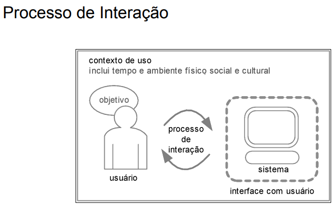
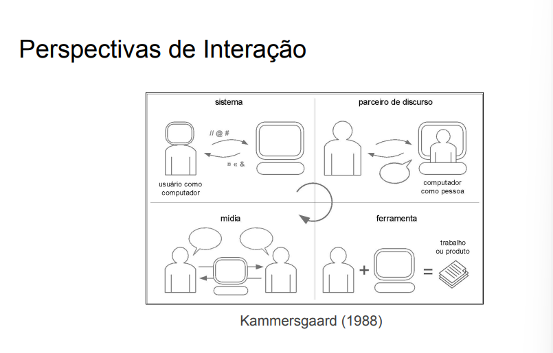
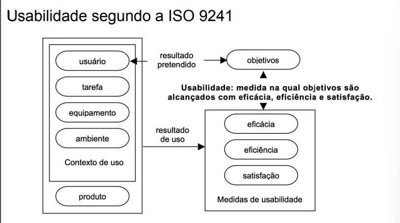
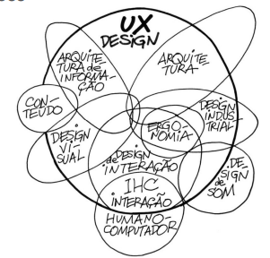
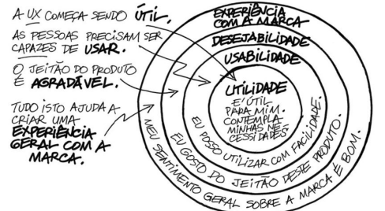

## Conceitos Básicos
## Conteúdo
  * Processo de Interação
  * Interação 
  * Interface 
  * Affordance 
  * Usabilidade 
  * Experiência do Usuário (UX)
  * Acessibilidade
  * Comunicabilidade 
  * Ergonomia 

-----

---
## Processo de Interação
  * **INTERAÇÃO →** investiga o que ocorre enquanto as pessoas utilizam sistemas interativos 
  * **CONTEXTO DE USO →** influenciado pela cultura, sociedade e organização
  * **USUÁRIO →** capacidade cognitiva para aprendizagem
  * **SISTEMA →** dispositivos e tecnologias (pode envolver áreas como computação gráfica e IA)
  * **INTERFACE COM USUÁRIO →** métodos, técnicas, ferramentas de construção e avaliação

### Exemplo (3 contextos distintos):
  * Preparando a aula 
  * Revisando a aula 
  * Apresentando a aula 
O que muda em cada contexto? 

-----

## Interação

  * é um processo de...
      * sequência de estímulos e respostas
      * operação de máquina

> Norman (1986) interpreta a interação como um processo através do qual o usuário formula uma intenção, planeja suas ações, atua sobre a interface, percebe e interpreta a resposta do sistema e avalia se seu objetivo foi alcançado. 

      * comunicação com/por meio da máquina
> de Souza (2005) interpreta a interação com um processo de comunicação entre pessoas (incluindo o designer e os usuários), mediada por sistemas computacionais.

  * A interação usuário-sistema pode ser considerada como tudo o que acontece quando uma pessoa e um sistema computacional se unem para realizar tarefas, visando um objetivo (Hix e Hartson, 1993).

  * No geral, podemos considerar a interação usuário-sistema como sendo um processo de manipulação, comunicação, conversa, troca, influência, e assim por diante. 
  
  * Kammersgaard (1988) identificou quatro perspectivas de interação usuário-sistema: perspectiva de sistema, de parceiro de discurso, de ferramenta e de mídia.
  
  * Essas perspectivas de interação descrevem formas de se interpretar a interação usuário-sistema, caracterizando o papel de ambos nesse processo.

---

---

### Perspectivas de Interação (Kammersgaard, 1988)

  * **Perspectiva de sistema:**
      * O usuário é considerado como um sistema computacional, e a interação humano-computador aproxima-se da interação entre sistemas computacionais 

      * É vista como uma mera transmissão de dados entre pessoas e sistemas computacionais, análoga à transmissão de dados entre sistemas 

      * **Exemplos:** Atalhos como Ctrl+C e Ctrl+V 

  * **Parceiro do discurso:**
      * Nessa perspectiva, o sistema interativo deve participar da interação assumindo papel à altura de um ser humano, sendo capaz de raciocinar, fazer inferências, tomar decisões, adquirir informação, enfim, o sistema deve ser capaz de se comportar de forma semelhante aos seus usuários 

      * Surgiu na área de Inteligência Artificial como uma proposta de transformar o sistema interativo em parceiro do discurso, se opondo à perspectiva de sistema
      
      * **Exemplo:** ChatGPT, Bots de atendimento 

  * **Ferramenta:**
      * O sistema interativo é considerado um instrumento que auxilia o usuário a realizar suas tarefas 

      * Nessa perspectiva, a interação representa um processo de aplicar uma ferramenta a algum material e avaliar o resultado durante a realização de uma atividade 

      * O processo de interação é descrito principalmente pelo encadeamento de ações e reações empregando tal ferramenta (um sistema interativo) 

      * **Exemplos:** Pacote Office, Visual Studio Code 

  * **Mídia:**
      * O sistema interativo é visto como uma mídia (semelhante à imprensa, televisão, rádio e telefone) através da qual as pessoas se comunicam umas com as outras 

      * Assim, a interação significa comunicação por meio da mídia num contexto coletivo 

      * A perspectiva de mídia e a perspectiva de parceiro de discurso são distintas. Enquanto a primeira vê a interação como uma conversa usuário-sistema, a segunda a vê como uma comunicação entre pessoas mediada por tecnologia 

      * **Exemplos:** Gmail, WhatsApp, Twitter

| perspectiva | significado de interação | fatores de qualidade mais evidentes |
| :--- | :--- | :--- |
| **sistema** | transmissão de dados | eficiência (tal como indicado pelo tempo de uso e número de erros cometidos) |
| **parceiro de discurso** | conversa usuário-sistema | adequação da interpretação e geração de textos |
| **ferramenta** | manipulação da ferramenta | funcionalidades relevantes ao usuário, facilidade de uso |
| **mídia** | comunicação entre usuários e designer-usuário | qualidade da comunicação mediada e entendimento mútuo |

-----

## Interface
> único meio de contato entre usuário e sistema.

> toda a porção do sistema com a qual o usuário mantém contato físico (motor ou perceptivo) ou conceitual durante a interação (Moran, 1981)

  * O contato físico na interface ocorre através do hardware e do software utilizados durante a interação.

      * Dispositivos de entrada, como teclado e mouse, permitem ao usuário agir sobre a interface do sistema e participar ativamente da interação.
      * Já os dispositivos de saída, como monitor e alto-falante, permitem ao usuário perceber as reações do sistema e participar passivamente da interação.

  * O contato conceitual com a interface envolve a interpretação do usuário daquilo que ele percebe através do contato físico com os dispositivos de entrada e de saída durante o uso do sistema.

      * Essa interpretação permite ao usuário compreender as respostas do sistema e planejar os próximos caminhos de interação.

  * Todos os elementos envolvidos no processo de interação estão fortemente relacionados 

  * O contexto de uso influencia a forma como os usuários percebem e interpretam a interface, e também seus objetivos 

  * **Exemplos:**

      * Uma resposta sonora é pouco útil em um ambiente de uso barulhento porque pode passar despercebida 
      * Pessoas daltônicas podem não diferenciar informações expressas por determinadas cores na interface 
      * Não podemos esperar que um analfabeto aprenda a usar a interface lendo instruções na tela
- Processo rápido por imagens e poucos textos. 
- Adaptação ao público alvo.
---

## Affordance
> Características de um objeto capazes de revelar aos seus usuários as operações e manipulações que eles podem fazer com ele (Norman, 1988), por desenho ou símbolos textual. 

  * **Affordances percebidas:** ações que o usuário percebe serem possíveis 

  * **Affordances reais:** ações que de fato são possíveis 

  * As affordances percebidas nem sempre correspondem às reais!

  * Os designers devem tomar cuidado para não criarem falsas affordances, pois os efeitos colaterais são inconvenientes 

  * As falsas affordances podem dar a impressão de que a interface funciona de determinada maneira, quando na verdade funciona de outra forma.
- Ex: Itens ou icones falsos. 
- Lembre-se

> "Quando coisas simples precisam de figuras, etiquetas ou instruções, o design falhou!" - Don Norman 

---

## Usabilidade
### segundo a ISO 
> Grau no qual um produto ou sistema pode ser usado por determinados usuários para alcançar determinados objetivos de maneira efetiva, eficiente e satisfatória em determinado contexto de uso 

  * **Subcategorias:**
      * **Capacidade de Reconhecimento Adequado (appropriateness recognizability)**.
      - Grau em que os usuários podem reconhecer se um produto ou sistema é apropriado para suas necessidades. 
      - Depende da capacidade de reconhecer a adequação das funções do produto ou sistema a partir de impressões iniciais do produto ou sistema e/ou qualquer documentação associada.
      - As informações fornecidas pelo produto ou sistema podem incluir demonstrações, tutoriais, documentação ou, para um site, as informações na página inicial.

      * **Facilidade de Aprendizado (learnability)**.
      - Grau em que um produto ou sistema pode ser usado por usuários específicos para atingir objetivos específicos de aprender a usar o produto ou sistema com eficácia, eficiência, livre de riscos e satisfação em um contexto específico de uso. 

      * **Operabilidade (operability)**.
      - Grau em que um produto ou sistema possui atributos que facilitam sua operação e controle.

      * **Capacidade de Proteção Contra Erros do Usuário (user error protection).**
      - Grau em que um sistema protege os usuários contra cometer erros.

      * **Estética da Interface (user interface aesthetics).**
      - Grau em que uma interface de usuário permite uma interação agradável e satisfatória para o usuário. 
      - Refere-se às propriedades do produto ou sistema que aumentam o prazer e a satisfação do usuário, como o uso da cor e a natureza do design gráfico.

      * **Acessibilidade (accessibility).**
      - Grau em que um produto ou sistema pode ser usado por pessoas com a mais ampla gama de características e capacidades para atingir um objetivo específico em um contexto de uso específico.

### segundo a ISO 

> Medida na qual um produto pode ser usado por usuários específicos para alcançar objetivos específicos com eficácia, eficiência e satisfação em um contexto específico de uso 

  * **Eficácia:** Acurácia e completude com as quais usuários alcançam objetivos específicos 
  * **Eficiência:** Recursos gastos em relação à acurácia e abrangência com as quais usuários atingem objetivos 
  * **Satisfação:** Ausência do desconforto e presença de atitudes positivas para com o uso de um produto 

---

---
### segundo Nielsen

Para Nielsen (1993), a usabilidade é um conjunto de fatores: 
  
  * facilidade de aprendizado (learnability) 
  - Deve ser fácil para o usuário aprender a utilizar o software

  * facilidade de recordação (memorability) 
  - A interface deve permitir que o usuário (esporádico) consiga utilizar o software adequadamente mesmo quando fica sem usá-lo por um período relativamente longo de tempo

  * eficiência (efficiency)
  - A interface deve permitir bom desempenho do usuário na realização de suas tarefas 
  - Não se está falando de desempenho do software, que é um atributo de qualidade utilizado na engenharia de software

  * segurança no uso (safety) 
  - ○ O sistema deve prevenir erros do usuário quando o utiliza em suas atividades 
  - Cabe observar aqui também que não se está falando de erros no programa, mas sim de erros do usuário ao utilizar o sistema

  * satisfação do usuário (satisfaction) 
  - O usuário deve gostar de utilizar o sistema 
  - A satisfação é um aspecto subjetivo, pessoal, mas ainda assim importante e que deve ser buscado no desenvolvimento de um produto de software

### Slogans de Usabilidade (Nielsen, 2003)

- **Sua melhor tentativa não é boa o suficiente**
    - É impossível fazer o design de uma interface apenas baseando-se nas melhores ideias.
    - O usuário possui potencial infinito para criar interpretações sobre os elementos da interface e realizar tarefas de modo diferente do que imaginamos.
    - O design é sempre melhor se trabalhamos com base no entendimento do usuário e de suas tarefas.
    - Deve haver preocupação em validar ou avaliar os designs usando as diferentes formas de avaliação existentes.

- **Usuário está sempre certo**
    - O designer, ao perceber problemas de interação com a interface, não deve julgar o usuário como ignorante ou desinteressado.
    - O designer de interfaces deve ser humilde e aceitar a necessidade de modificar o sistema conforme as necessidades reais dos usuários.

- **Usuário não está sempre certo**
    - O designer não deve ir ao extremo de desenvolver uma interface somente a partir do que os usuários desejam, pois muitas vezes eles não sabem o que desejam.

- **Usuários não são designers**
    - É importante desenvolver interfaces flexíveis que possam ser personalizadas de acordo com o nível do usuário.

- **Designers não são usuários**
    - Designers possuem experiência computacional e conhecimento dos fundamentos conceituais.
    - Às vezes, para o designer, a informação está totalmente clara, mas nem sempre o usuário compreende o sistema proposto.

- **Menos é mais**
    - Cada elemento de uma interface gera sobrecarga no usuário, que precisa avaliar se deve usar a ferramenta ou não.
    - Oferecer poucas opções necessárias para a realização da tarefa geralmente significa criar melhor usabilidade, pois o usuário pode se concentrar.

- **Help não ajuda**
    - Muitas vezes o help mais atrapalha do que ajuda, pois, além da complexidade do conteúdo, as informações são perdidas entre risomas de links e hiperlinks de difícil acesso.

-----

## Experiência do Usuário (UX)

  * Segundo Norman (2013), a experiência do usuário com um produto vai muito além da sua usabilidade; inclui ainda mais aspectos subjetivos, como estética, prazer e diversão
  * Envolve o modo como o uso de sistemas interativos afetam os sentimentos e as emoções do usuário 
  * **Exemplos de aspectos positivos e negativos:**
      * **Positivos:** satisfação, prazer, diversão, entretenimento, interesse, motivação, estética, criatividade, surpresa, desafio 
      * **Negativos:** cansaço, frustração e ofensa
  * Atualmente, UX se tornou o conceito "guarda-chuva" para englobar todas as atividades próximas ou relacionadas com o projeto de interfaces com o usuário, as interações homem-máquina e suas diversas implicações 

---

---
  * Para Chris Rohrer, a UX depende de um conjunto de fatores, que inicia com o produto sendo útil; depois, com ele sendo fácil de utilizar; em seguida, com ele sendo agradável; e, por último, com ele causando uma boa impressão da marca ou empresa 

---

---

## Acessibilidade

  * Oferecer meios para que o usuário acesse o sistema e interaja com ele, sem que a interface imponha obstáculos 
  * Pessoas com e sem limitações possuem igual importância, sejam limitações na capacidade de movimento, de percepção, de cognição ou de aprendizado 
  * Cuidar da acessibilidade permite que mais pessoas usem o sistema (tanto sem quanto com limitações), e não apenas poucas pessoas com características específicas
### é lei

> ... será obrigatória a acessibilidade nos portais e sítios eletrônicos da administração pública na rede mundial de computadores (Internet), para o uso das pessoas portadoras de deficiência visual, garantindo-lhes o pleno acesso às informações disponíveis. 

-----

## Comunicabilidade

  * A interface deve comunicar ao usuário a lógica do design:
      * a quem se destina o sistema,.
      * para que ele serve,.
      * qual a vantagem de utilizá-lo,.
      * como ele funciona e.
      * quais são os princípios gerais de interação com o sistema.
  * Permite que os usuários tirem melhor proveito do sistema, por comunicar estratégias de uso adequadas a cada situação.
  * Conceito proposto pela engenharia semiótica, uma teoria de IHC (de Souza, 2005).

-----

## Ergonomia

  * Durante o trabalho, o ser humano interage com máquinas, ferramentas e mobiliário, que formam interfaces sensoriais dos mais diversos tipos 
  * A ergonomia surge então com o objetivo de modelar essas interfaces de modo a focar no homem e em seu processo de trabalho, a fim de eliminar riscos e esforços, além da busca constante pelo conforto e pela eficiência do sistema (ROSSETE, 2014) 
  * **Aspectos considerados no estudo de ergonomia:**
      * Análise e controle do espaço físico e dos ambientes de trabalho 
      * Questões fisiológicas como esforço físico e higiene 
      * Interface com máquinas, equipamentos, ferramentas, mobiliário e instalações 
      * Adaptação do homem ao ambiente de trabalho envolvendo aspectos ambientais como ruídos, alimentação, iluminação e ventilação, etc 
> Postura, Auditiva, Visual, Energetica e Organzacional.

  * **Princípios:**
      * Ajustar às exigências do trabalho às possibilidades do ser humano, com o intuito de reduzir a carga externa 
      * Conceber máquinas e ferramentas pensando em maior eficácia, precisão e segurança 
      * Estudar cuidadosamente a configuração dos postos de trabalho, de forma assegurar ao trabalhador uma postura correta 
      * Adaptar um ambiente às necessidades físicas do ser humano 
  * É importante notar que a ergonomia deve pensar na melhor maneira de algo se adaptar ao seu usuário, e não que o ser humano precisa se adaptar a esse algo!

### Conteúdo - obs:
### Análise das Perspectivas
#### **1. Perspectiva de SISTEMA**
**A Pergunta:** "Quando a interação se reduz a uma transmissão de dados ou execução de comandos?"

* **O que você precisa procurar?** Procure por momentos em que **o sistema está no controle** e você tem pouca ou nenhuma liberdade. São situações em que o sistema te guia por um caminho obrigatório para cumprir um objetivo **dele** (ganhar dinheiro, garantir segurança, organizar dados).

#### **2. Perspectiva de PARCEIRO DE DISCURSO**
**A Pergunta:** "Em quais situações o sistema se comporta como um interlocutor (raciocina, decide ou interage de forma 'humana')?"

* **O que você precisa procurar?** Procure por momentos em que o sistema parece **"pensar" por você** ou **"conversar" com você**. Ele não está apenas respondendo a um comando, mas sim interpretando seu comportamento para te oferecer algo novo e personalizado.

#### **3. Perspectiva de FERRAMENTA**
**A Pergunta:** "Como o sistema funciona como instrumento para você realizar tarefas?"

* **O que você precisa procurar?** Procure por momentos em que **você está 100% no controle**. O sistema é como um objeto passivo (um martelo, um lápis) que faz exatamente o que você manda, de forma imediata e previsível.

#### **4. Perspectiva de MÍDIA**
**A Pergunta:** "De que maneira o sistema atua como canal de comunicação entre pessoas?"

* **O que você precisa procurar?** Procure por momentos em que seu objetivo principal é **interagir com outra pessoa**, não com o sistema. O sistema é apenas o "lugar" ou o "canal" que torna essa comunicação humana possível.