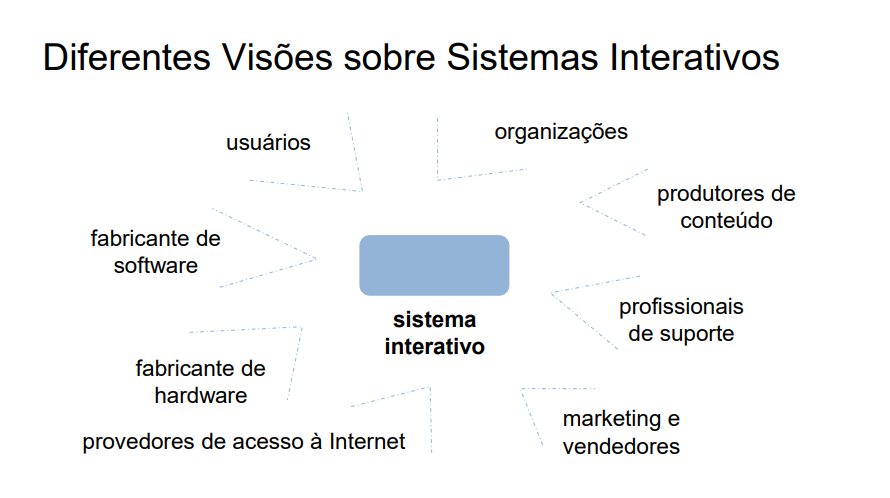
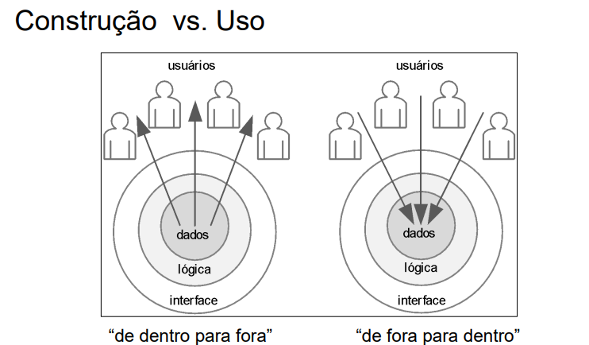
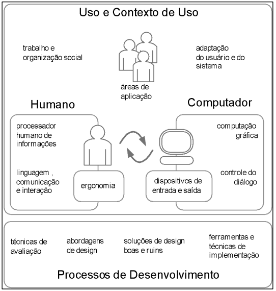

## Princípios de projeto de interfaces homem-computador
### Introdução à Interação Humano-Computador
#### TICs (Tecnologias de Informação e Comunicação):
- Em quais ferramentas, instrumentos ou dispositivos elas estão presentes?
- Celular usado como cartão de crédito
- Quiosque eletrônico para consulta numa livraria
- Livros eletrônicos
- Consoles de jogos que exercitam mente e corpo
- TV digital interativa
- Participação política na internet usando diversos dispositivos e ferramentas

> Qual importância as TICs adquiriram?
- As TICs tornaramse estruturantes na sociedade contemporânea. Elas estão presentes em praticamente todas as áreas da vida moderna.
- **Pessoal**: comunicação (redes sociais, mensagens), entretenimento (streaming,
games), acesso à informação, educação, saúde (telemedicina, exames online),
etc.
- **Profissional**: automação de processos, comércio eletrônico, bancos digitais,
tele-trabalho, gestão de negócios, etc.

> Qual importância as TICs adquiriram?
- Sua importância está na capacidade de conectar pessoas, otimizar processos, democratizar o acesso à informação e criar novas formas de interação e trabalho.

> Elas afetam a vida das pessoas?
- Sim, elas alteram o Comportamento. Expectativas. Dependência. Inclusão/Exclusão.

> O que pode ocorrer se as TICs falharem?
- Paralisação de serviços essenciais, Perda de dados, Prejuízos econômicos, Impactos sociais.

> Consequências pra quem usa:
- Frustração e estresse ao lidar com sistemas mal projetados.
- Prejuízos materiais ou de tempo em caso de falhas.
- Exclusão digital se a interface for complexa ou inacessível.

> Consequências para quem desenvolve:
- Responsabilidade ética e técnica pelas consequências do sistema.
- Impacto na reputação profissional ou da empresa.
- Riscos legais em caso de falhas graves (ex.: vazamento de dados)

> Exemplo:
- Cédula (papel) vs. urna eletrônica

#### Responsabilidade do desenvolvedor de TICs

- Estar ciente de que seu trabalho afeta a vida das pessoas
- Tentar prever os impactos do seu trabalho para
- Encaminhar boas intervenções/soluções e Diminuir os impactos negativos previstos
- Fornecer salvaguardas para impactos negativos imprevistos

#### Diferentes Visões sobre Sistemas Interativos

---

Exemplo: construção de um sistema para uma empresa

> Visão do Cliente: interessado no que será possível fazer com o sistema.
> Visão dos Desenvolvedores: concentram nas funcionalidades do software e sua estrutura interna.
> Visão dos Funcionários: como vão aprender a utilizar o software para realizar seu trabalho com eficiência.
> Visão dos Diretores: como o sistema irá trazer mais dinheiro para a empresa.

#### Construção vs. Uso

- Grande parte da computação costuma projetar um sistema DE DENTRO PARA FORA, isto é, construir primeiro sua representação de dados, algoritmos, arquitetura que permita o sistema funcionar → **qualidade na construção**.
- A IHC propõe, por outro lado, que sistemas sejam construídos DE FORA PARA DENTRO, iniciando pela investigação dos usuários envolvidos, interesses, objetivos, limitações, motivações, contexto de uso (escritório, hospital, etc) → **qualidade de uso**.

---

---

### ICH - Interação Humano-Computador

- O que é IHC?
- Área interdisciplinar que estuda a interação entre pessoas (usuários) e sistemas computacionais.
- Objetivo: projetar, avaliar e implementar sistemas interativos que sejam eficazes, eficientes e satisfatórios para os usuários.

---

---

> CONTRIBUIÇÕES:
- aumentar a produtividade dos usuários
- reduzir o número e a gravidade dos erros
- reduzir o custo de treinamento
- reduzir o custo de suporte técnico
- aumentar as vendas e a fidelidade do cliente

### Exercício

Em grupos de até 5 pessoas, analisem e discutam as situações apresentadas e respondam:

- O que muda em relação aos dois contextos de uso?
- O que muda em relação aos objetivos dos dois usuários?
- O que muda em relação a interação que cada um dos usuários vai ter com o sistema?
- Quais são os aspectos positivos e negativos em cada interação?

Exercício

- Situações:
    1. Uma pessoa que paga suas contas pelo computador pessoal de casa e outra que paga suas contas em um caixa eletrônico
    2. Um adolescente com poucos compromissos usando um sistema de agenda no seu celular, ou um adulto que possui muitos compromissos administrando sua agenda no computador de sua empresa
    3. Uma pessoa solicitando um moto-táxi pelo WhatsApp e outra pessoa solicitando transporte através de um aplicativo específico
    4. Um estudante preparando a apresentação do seu TCC em seu computador pessoal e um estudante apresentando o seu TCC usando um projetor em uma sala
    5. Uma pessoa assistindo um vídeo no Youtube pelo seu celular e outra assistindo um filme na Netflix na TV de sua casa
