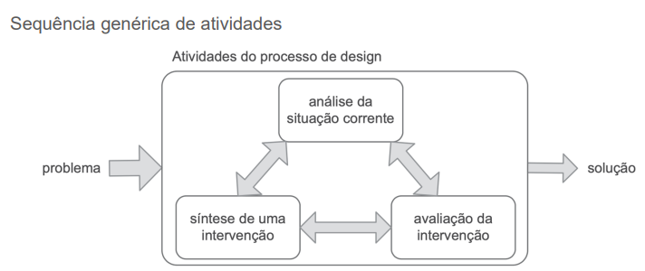
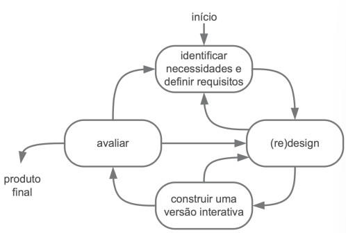
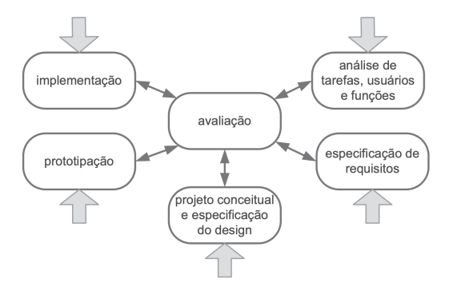
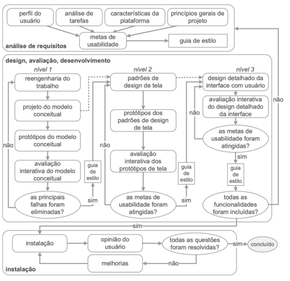
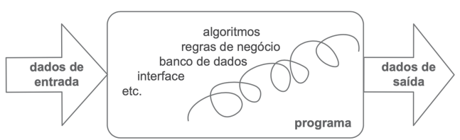
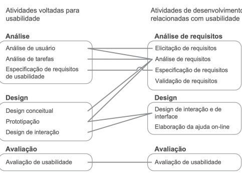

## Processo de Design Centrado no Usuário
> Design – Contexto
- Lidamos frequentemente com artefatos (produtos artificiais, fruto da inteligência e do trabalho humano, construídos com um determinado propósito em mente).

- Quando analisamos uma situação, considerando pessoas, artefatos, processos e relações entre eles, podemos encontrar problemas e coisas agradáveis.

- Atitudes são comuns para resolver problemas ou melhorar o que for possível. Tais atitudes envolvem atividades de design, realizada com cuidado maior ou menor.

### O que é design?
- Design é um processo composto por três atividades básicas: 

> Análise da situação atual: Estudar e compreender a situação existente. 

> Síntese de uma intervenção: Planejar e criar uma nova solução ou modificação para a situação atual. 

> Avaliação da nova situação: Verificar os efeitos da intervenção, comparando o resultado com a situação original. 

- Explicação Intuitiva: Pense no design como um ciclo para resolver problemas. Primeiro, você entende o problema (análise). Depois, você cria uma solução (síntese). Finalmente, você testa para ver se a solução funcionou (avaliação). Se não funcionou perfeitamente, você usa o que aprendeu para entender melhor o problema e criar uma solução ainda melhor, repetindo o ciclo.

> Na análise da situação atual, buscamos conhecer os elementos envolvidos e as relações entre eles.

### Processos de Design de Interação Humano-Computador (IHC)
- O design é um processo que envolve análise (identificar o problema), síntese (projetar a solução) e avaliação da intervenção (Projetada ou já aplicada à situação atual). 

- Cada processo de design detalha essas atividades de maneira particular, definindo: 
> Como executar cada atividade; 

> Quais atividades podem se repetir e por quê; 

> A sequência em que devem ser executadas; 

> Os materiais (artefatos) que são usados e produzidos em cada etapa. 

### A Natureza Iterativa do Design de IHC
- Uma característica fundamental dos processos de design de IHC é que eles são ITERATIVOS. Isso permite refinar continuamente tanto a análise do problema quanto a proposta de solução. 

- Dessa forma, o designer aprende mais sobre o problema e sobre a solução que está criando. 

- O processo se repete quantas vezes forem necessárias até que se chegue a uma intervenção satisfatória. 

- Explicação Intuitiva: "Iterativo" significa que o processo é um ciclo de repetição e melhoria. Em vez de tentar acertar tudo de primeira, você cria uma versão inicial, testa, aprende com os erros e acertos e, em seguida, cria uma versão melhor. É como escrever um texto: você faz um rascunho, revisa, corrige e melhora a cada nova versão.

### Abordagens de Design em IHC
- Mesmo dentro do ciclo de análise, síntese e avaliação, o foco pode variar: 
- É possível empregar quantidade de tempo e esforço diferente
em cada uma delas:

+ **Design Dirigido pelo Problema**: Gasta-se mais tempo e esforço na análise da situação atual, nas necessidades dos usuários e nas oportunidades de melhoria. O foco principal é entender o problema profundamente antes de pensar em soluções. 

- **Design Dirigido pela Solução**: Faz o contrário. Gasta-se mais tempo explorando e construindo diferentes intervenções (soluções) e menos tempo na análise inicial. 

### Diagrama do Processo de Design

---
Explicação Intuitiva: Este diagrama reforça a ideia de que as três atividades (análise, síntese e avaliação) estão totalmente interligadas. Você pode pular de uma para a outra conforme aprende mais sobre o problema e a solução. O objetivo é transformar um "problema" em uma "solução" através deste ciclo dinâmico.

### Princípios do Design Centrado no Usuário
Os processos de design de IHC buscam servir, em primeiro lugar, aos usuários e stakeholders, e não à tecnologia. Para ser "centrado no usuário", um processo segue estes princípios: 

* **Foco no usuário**: O designer deve estudar profundamente quem são os usuários: seus objetivos, características (físicas, cognitivas), formação e como realizam suas tarefas atualmente. 

* **Métricas observáveis**: O processo deve permitir a realização de experimentos (com protótipos ou simulações) para medir o desempenho e as reações dos usuários de forma concreta. 

* **Design iterativo**: Se os testes com usuários revelarem problemas, eles devem ser corrigidos em uma nova versão do design. 

### Modelos de Processos de Design de IHC
- Existem vários modelos estabelecidos para guiar o processo de design, entre eles:

* **Ciclo de Vida Simples** 
- É o ciclo básico e fundamental de "fazer e melhorar". Ele segue uma sequência lógica de passos que se repetem.

> Analogia para Ajudar a Lembrar: Pense em cozinhar uma receita nova.
- 0.1 - INICIO.
- 0.2 - Identificar Necessidades: Você decide o que quer cozinhar e lista os ingredientes (requisitos).
- 0.3 (Re)Design: Você pensa no passo a passo de como vai preparar o prato (o design).
- 0.4 Construir Versão Interativa: Você cozinha uma pequena porção para experimentar (o protótipo).
- 0.5 Avaliar: Você prova e vê se precisa de mais sal, mais tempo no forno, etc. (avaliação).
> Com base no que você provou, você ajusta a receita e começa o ciclo de novo, até o prato ficar perfeito para servir (o produto final).

---

---
* **Ciclo de Vida em Estrela**
- A Ideia Principal: A avaliação não é apenas uma fase, ela é o centro de tudo. Todas as outras atividades dependem e estão conectadas a ela.

> Analogia para Ajudar a Lembrar: Imagine organizar uma viagem em grupo.
- O "centro da estrela" é o grupo de WhatsApp da viagem (a Avaliação).

- As "pontas da estrela" são as tarefas: pesquisar hotéis (Análise), criar um roteiro (Design Conceitual), comprar passagens (Implementação), etc..

> A regra é: não importa qual tarefa você faça, você imediatamente manda no grupo para todo mundo dar opinião. Você não precisa seguir uma ordem fixa (pode comprar a passagem antes de definir o roteiro), mas cada passo precisa ser validado pelo grupo antes de continuar.

---

> Análise de tarefas, usuários e funções.
- Responsável pelo aprendizado da situação atual e pelo levantamento das necessidades e oportunidades de melhoria
> Especiificação.
- Consolida uma interpretação da análise, definindo os problemas que devem ser resolvidos com o projeto.

> Implementação.
- Desenvolvimento do sistema interativo.

> Prototipação.
- Elaboração de versões interativas das propostas de solução.

> Projeto conceitual e especificação do design
- Concepção da solução. 

> Avaliação
- Aparece no modelo como central, e é de fato desdobrada na avaliação dos resultados de cada uma das demais atividades
---

* **Engenharia de Usabilidade de Nielsen** 
- A Ideia Principal: É um conjunto de 10 "mandamentos" práticos ou atividades que um designer deve seguir durante todo o projeto para garantir que o produto final seja fácil de usar.

- Jakob Nielsen (1993) definiu engenharia de usabilidade como um conjunto de atividades que devem ocorrer durante todo o ciclo de vida do produto, ressaltando que muitas delas ocorrem nos estágios iniciais do projeto, antes que a interface com usuário em si seja projetada

> Analogia para Ajudar a Lembrar: Pense no checklist de um piloto de avião antes de decolar.
- O piloto não segue um fluxo complexo, mas sim uma lista de verificações essenciais para garantir um voo seguro.
- os seguintes:
> 1. **Conheça seu usuário**
- Consiste em estudar os usuários (e demais stakeholders) e os usos pretendidos do produto.

> 2. **Realize uma análise competitiva**
- Consiste em examinar produtos com funcionalidades semelhantes ou complementares
- Como esses produtos já estão prontos, podem ser testados com mais facilidade e realismo do
que protótipos
- Como resultado, o designer pode obter um conjunto de informações sobre o que funciona e o que não funciona naquele domínio, o que pode ser aperfeiçoado, e por quê.

> 3. **Defina as metas de usabilidade**
- Envolve definir os fatores de qualidade de uso que devem ser priorizados no projeto, como serão avaliados ao longo do processo de design, e quais faixas de valores são inaceitáveis, aceitáveis e ideais para cada indicador de interesse.

> 4. **Faça designs paralelos**
- Consiste em elaborar diferentes alternativas de design, de preferência por três ou quatro designers trabalhando de forma independente, para então selecionar as que vão ser detalhadas nas atividades seguintes do processo.

> 5. **Adote o design participativo**
- Consiste em a equipe de design ter acesso permanente a um conjunto de usuários tidos como representativos da população-alvo de usuários para que eles possam dar feedbacks durante o processo.

> 6. **Faça o design coordenado da interface como um todo**
-  Consiste em evitar inconsistências na interface com usuário projetada.
- Isso inclui não apenas os elementos de interface propriamente ditos, mas também toda a documentação, o sistema de ajuda e tutoriais produzidos sobre o sistema.

> 7. **Aplique diretrizes e análise heurística**
- Consistem em seguir princípios bem conhecidos para o design da interface com usuário 
- À medida que a interface for projetada, deve ser feita uma avaliação heurística para avaliar se as diretrizes não estão sendo violadas

> 8. **Faça protótipos**
- Fazer dos sistemas finais antes de iniciar os esforços de
implementação.
- Para que essa atividade possua custo baixo, apenas parte do sistema é prototipada:

*■* Protótipo horizontal, que visa apresentar o sistema em abrangência mas com pouca
profundidade (i.e., a aparência da interface e navegação entre telas, mas sem a
funcionalidade subjacente)

*■* Protótipo vertical, no qual pouca funcionalidade é explorada em profundidade para que
seja testada em circunstâncias realistas
> 9. **Realize testes empíricos**
- Consiste em realizar testes empíricos a partir dos protótipos, ou seja, consiste na observaçãodos usuários ao utilizarem os protótipos para realizar certas tarefas (teste de usabilidade)
> 10. **Pratique design iterativo**
- Com base nos problemas de usabilidade e nas oportunidades reveladas pelos testes
empíricos, os designers produzem uma nova versão da interface, e repassam pelas
atividades do processo.
- Problemas a cada iteração vão sendo corrigidos. 

* **Engenharia de Usabilidade de Mayhew**
- A Ideia Principal: É o modelo mais estruturado, detalhado e "corporativo". Ele divide o processo em fases e níveis bem definidos, indo do geral para o específico.

---

> 0.1 Análise de requisitos:
- Na fase de análise de requisitos são definidas as metas de usabilidade com base no perfil dos usuários, análise de tarefas, possibilidades e limitações da plataforma em que o sistema será executado e princípios gerais de design de IHC

- Nesse processo, as metas de usabilidade costumam ser representadas em “guias de estilos” para auxiliar sua verificação durante as demais atividades do processo.

> 0.2 Design, avaliação, desenvolvimento:
- Tem por objetivo conceber uma solução de IHC que atenda às metas de usabilidade estabelecidas na fase anterior.
- Durante o desenvolvimento, a interface deve ser avaliada com os usuários.

> 0.3 Instalação: 
- O designer deve coletar opiniões dos usuários depois de algum tempo de uso.
- Essas opiniões serão úteis para melhorar o sistema em versões futuras ou até mesmo para apontar a necessidade de desenvolver novos sistemas interativos ainda não previstos.

--- 

* **Design Baseado em Cenários** 
- É um processo que utiliza diferentes tipos de cenários como representação básica e fundamental durante todas as atividades envolvidas na concepção de uma solução de IHC.
-  Um cenário é “simplesmente uma história sobre pessoas executando uma
atividade”
-  Ao escrever, ler e revisar cenários, a equipe tem a oportunidade de discutir e
analisar como as atividades dos usuários são afetadas pela tecnologia
existente e como elas poderiam ser afetadas pelo sistema sendo
desenvolvido
-  As histórias dos cenários estimulam a imaginação da equipe de design e
encorajam a análise de caminhos alternativos.

---

---
> Com (ES):
- **Na perspectiva de design centrada no sistema**, comum na ES, um
sistema interativo é um artefato circunscrito e encapsulado por uma interface
que recebe dados de entrada, processa esses dados com algum programa
(codificado em software ou hardware) e retorna dados de saída.

---

---

- **Na perspectiva do design centrado no uso**o, comum na IHC, um sistema interativo é um artefato com o qual o usuário interage durante a realização de suas atividades em determinado contexto. 
 
- O foco dessa perspectiva deixou de ser o que ocorre dentro do sistema e passou para aquilo que ocorre fora do sistema e através da sua interface  
- O mais importante nessa perspectiva é a forma como o usuário se apropria daquilo que o sistema pode oferecer em apoio aos seus objetivos em um determinado contexto  
- Assim, seu objetivo é conceber (mais no sentido de projetar e avaliar do que implementar) um sistema interativo que sirva de apoio ao usuário na realização de suas atividades e no alcance dos seus objetivos

### Integração das Atividades de IHC com Engenharia de Software
- As diferentes perspectivas de IHC e ES sobre o desenvolvimento de sistemas interativos deram origem a métodos, técnicas e processos próprios de cada área.

> CARACTERÍSTICAS:
- Definição de características de um processo de desenvolvimento que se preocupa com a qualidade de uso.

- Definição de processos de IHC paralelos que devem ser incorporados aos processos propostos pela ES.

- Indicação de pontos em processos propostos pela ES em que atividades e métodos de IHC podem ser inseridos.  

---

---

#### Métodos Ágeis e IHC: A Relação entre Métodos Ágeis e IHC
> Pontos Positivos:
- Os métodos ágeis, como Scrum e XP, são naturalmente compatíveis com a IHC porque ambos trabalham com ciclos curtos de desenvolvimento (iterações).
- Essa abordagem permite obter feedback constante do cliente, o que é ótimo para corrigir e melhorar o projeto continuamente.

> O Problema Principal:
- Apesar da compatibilidade, a comunidade ágil foca muito no "cliente" (quem paga pelo projeto), mas raramente menciona o "usuário" final (quem de fato vai usar o software).
 Isso pode levar à negligência da experiência de uso e da qualidade da interface.

> A Solução (Sugestões de Blomkvist):
Para resolver esse problema, é preciso integrar práticas de IHC diretamente no processo ágil:
Mudar o Foco: O objetivo principal não é apenas entregar um software que funciona, mas um software que seja usável.
Envolver as Pessoas Certas: É crucial envolver ativamente os usuários reais, e não apenas os clientes, em todas as etapas do desenvolvimento.
Definir Responsabilidades: O designer de IHC deve ser o responsável final pelas decisões sobre a qualidade de uso do produto.
Aprofundar a Análise: A pesquisa sobre o usuário e seu contexto deve ser mais rica e detalhada do que as simples "histórias de usuário" (user stories) usadas nos métodos ágeis.
Avaliar Sempre: É necessário fazer avaliações de IHC (como testes de usabilidade) em diferentes estágios do desenvolvimento, e não apenas no final.