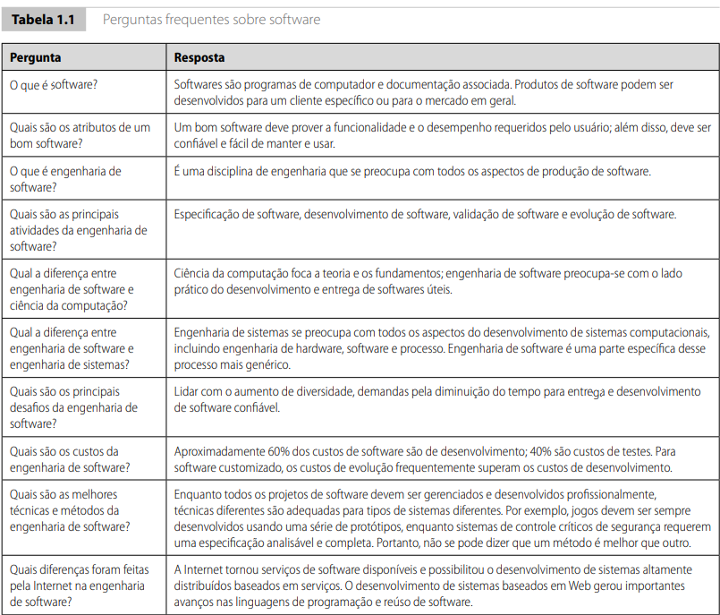
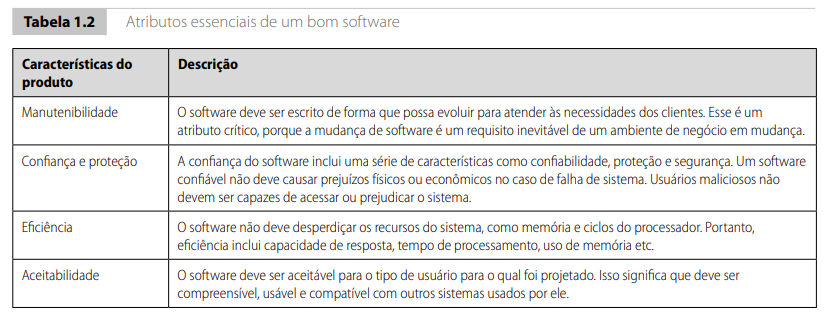

## Princípios de Software e Engenharia de Software
### Introdução à Engenharia de Software
> Motivação:
- Tecnologia de hardware apresentava grandes avanços.
- Varias tarefas simples e bemestruturadas em hardware.
- Custo maior pelo software.

> Crise do Software:
- Os grandes software não funcionavam adequadamente
- Os projetos de software estavam sempre atrasados
- Os custos dos projetos de desenvolvimento eram sempre maiores
do que o previsto.
- A produtividade não acompanhava a demanda
- Os custos com manutenção eram muito altos.

+ A qualidade do software geralmente era duvidosa.
+ Software sem testes automatizados e com pouca cobertura.
+ Software feito por empresas sem maturidade ou com pessoal sem qualificação certificada.

- Ainda é possível visualiza-la. 
- Empresas e clientes reclamando sobre prazos não cumpridos;
- Custos muito elevados;
- Sistemas em uso exigindo muita manutenção;
- Usuários reclamam de erros e falhas em sistemas;
- Sentem-se inseguros em usá-los;
- Reclamam das atualizações frequentes e dos preços;

> Por que continua? Todos.
- Enquanto os desenvolvedores continuarem a utilizar processos artesanais; 
- Enquanto erros e acertos não forem capitalizados a crises há de seguir;

> O que é Engenharia de Software?
+ Engenharia de software é uma disciplina relacionada com todos os aspectos da produção de software. E propõe ferramentas, técnicas e processos para:
- Entender com precisão qual é o problema (as necessidades associadas ao sistema que deve ser construído/modificado)
- Produzir uma solução adequada para esse problema (um sistema pronto para usar, levando-se em consideração as necessidades das partes interessadas)
- Levando-se em conta restrições de desenvolvimento e recursos disponíveis

---

---

### O que é Software?
- R: Software é um conjunto de programas de computador, dados e informações documentadas e associadas que ditam ao computador o que fazer. Podendo ser desenvolvido para um cliente específico ou para o mercado em geral.
> Programas de computador e artefatos associados
> Software podem ser
- Genéricos – desenvolvidos para serem vendidos para uma grande variedade de clientes (e.g., Excel e Word)
- Personalizados – desenvolvidos para um único cliente de acordo com as suas especificações

> Criados e desenvolvido por novos porgramas, pode haver configuração de um sistea genárico ou reutilização de um produto já existente, seja no mercado, seja dentro da própria empresa.

### Quais são os atributos de um bom Software?

- R: Um bom software deve prover a funcionalidade e o desempenho requeridos pelo usuário; além disso, deve ser confiável e fácil de manter e usar.

• O software deve fornecer a funcionalidades requeridas para satisfazer as
necessidades do usuário e deve apresentar:
• Facilidade de manutenção
• Deve ser fácil e barato fazer com que o sistema, depois de implantado,
evolua para atender às necessidades dos clientes
• Confiabilidade
• O software deve funcionar conforme sua especificação
• Eficiência
• O software deve usar o mínimo de recursos maximizando funcionalidade
• Usabilidade
• O software deve ser compreensível e fácil de usar

### O que é Processo de Software?
Um conjunto estruturado de atividades, práticas, artefatos e ferramentas
necessários para o desenvolvimento de um sistema de software. E.g.
- Especificação
- Projeto
- Prototipação
- Validação
- Desenvolvimento
- Testes
- Implantação

- O processo de software abrange todas as atividades envolvidas no desenvolvimento de um produto de software. Ele consiste em um conjunto de atividades relacionadas, que podem incluir o desenvolvimento do software do zero em linguagens como Java ou C, ou ainda a extensão, modificação, configuração e integração de sistemas já existentes ou componentes de prateleira.

Apesar da variedade de processos de software, todos devem contemplar quatro atividades fundamentais:

1. **Especificação de software:** Definir claramente a funcionalidade do software e as restrições de seu funcionamento.
2. **Projeto e implementação de software:** Produzir o software conforme as especificações estabelecidas.
3. **Validação de software:** Garantir que o software atenda às necessidades e exigências do cliente.
4. **Evolução de software:** Adaptar e evoluir o software para acompanhar as mudanças nas necessidades dos clientes.

> Alguns elementos de um processo:
- Modelos de Sistema/Software.
- Recomendações de boas práticas de projeto.
- Atividades que devem ser seguidas em determinada ordem.

### O que é um processo de software?
- Conjuntos de práticas e tarefas que orientam o fluxo de desenvolvimento do software. 

###  O que é **Modelo de Processo de Software**?
É tipo um **mapa** que mostra **a ordem das etapas** do desenvolvimento de software.

* Ele responde: **“O que deve ser feito e em que ordem?”**
* Exemplos:

  * **Cascata** → segue etapas lineares (requisitos → projeto → implementação → testes).
  * **Iterativo** → vai entregando em partes, repetindo ciclos.
  * **Baseado em componentes** → monta o sistema a partir de partes já prontas.

> Pense no **modelo** como o “formato do caminho” que o time vai seguir.

###  O que é **Método de Processo de Software**?

É mais **detalhado**: mostra **como fazer** cada etapa do modelo, com técnicas, práticas e regras.

* Ele responde: **“Como deve ser feito?”**
* Exemplos:

  * **Scrum** → reuniões diárias, papéis bem definidos (Product Owner, Scrum Master).
  * **XP (Extreme Programming)** → programação em par, testes automatizados.
  * **RUP** → processos bem documentados e definidos em fases.

- Pense no **método** como o “jeito de andar nesse caminho” (as práticas que guiam a equipe).

---

⚡ Resumindo em 1 frase:

* **Modelo** → define o **que** e **quando** fazer.
* **Método** → define **como** fazer.

### O que é CASE:
- CASE (Computer-Aided Software Engineering) significa Engenharia de Software Assistida por Computador.
- Em outras palavras, são ferramentas ou softwares criados para ajudar desenvolvedores e equipes a planejar, projetar, documentar, implementar e até testar sistemas de software.
> Ferramenta CASE = um “programa que ajuda a desenvolver programas”. Não substitui.

### Quais são os principais desafios enfrentados pela Engenharia se Software?
> Lidar com a crescente diversidade

> É exigido que o Software moderno seja cada vez mais complexo (com recursos como, uso da IA , distribuído, paralelismo, entre outros)

> Demandas por menores prazos e menores custos

> Exigência de maior confiabilidade e qualidade

> Mudança continua de das necessidades (requisitos) dos clientes

> Projetos de software cada vez envolvem mais riscos (e.g. econômicos, ambientais) e demandam escalabilidade

### Quais são os custos da Engenharia de Software?
> Para software sob encomenda, os custos de manutenção normalmente excedem os de desenvolvimento

> Os custos variam dependendo do tipo de sistema que está sendodesenvolvido e dos requisitos do sistema, tais como desempenho e confiabilidade

> A distribuição de custos depende do modelo de desenvolvimento que é usado

### Qual é a diferença entre Engenharia de Software e Ciência da Computação?
- A Ciência da Computação dedica-se à teoria e aos fundamentos
- Engenharia de software dedica-se aos aspectos práticos de desenvolvimento de
software
> “O que” vs. “Como”
- Teorias de ciência da computação são ainda insuficientes e mudam frequentemente para atuar como uma base completa para a engenharia de software
- Em outras palavras: não há receitas prontas!
### Qual é a diferença entre Engenharia de Software e Engenharia de Sistemas?
- Engenharia de sistemas (Sistemas de Informação):
    - Mais ampla.
    - Ênfase em aspectos de infra-estrutura, recursos humanos e processos de negócios.
    - Abstração do hardware.
    - Organização física das partes do sistema.
    - Aspectos de comunicação, entre os recursos humanos.
    - Processos de Negócios (e BPM).
    - Engloba a engenharia do software.

- A Engenharia de Software envolve responsabilidades mais amplas do que simplesmente a aplicação de habilidades técnicas.
    - Os engenheiros de software devem se comportar de modo honesto e eticamente responsável para serem respeitados como profissionais.
    - O comportamento ético esperado é mais do que simplesmente o cumprimento das leis.
    > Confidencialidade.
    
    > Competência (capacidade).
    
    > Direitos sobre propriedade intelectual.

### Dilemas éticos (exemplos)
- Discordância, em princípio, das políticas da gerência sênior.
- Participação no desenvolvimento de sistemas de fraude, sistemas de armamentos militares ou de sistemas nucleares.

### Modelos de processo de software
- 0 processo de software: Conjunto estruturado de atividades necessárias para desenvolver um sistema de software.
- Existem vários processos de software mas todos envolvem:
- especificação – definição do quê o sistema deve fazer;
- projeto e implementação – definição da organização do sistema e implementação do sistema;
- validação – checagem de que o sistema faz o que o cliente deseja;
- evolução/manutenção – evolução em resposta a mudanças nas necessidades do cliente.

### Tipos de processos
+ Processos dirigidos a planos (tradicionais)
- todas as atividades do processo são planejadas com antecedência
- o progresso é medido em relação aos planos
+ Processo ágeis
- planejamento é incremental
- mais fácil modificar para refletir alterações nos requisitos do cliente

### Descrições de Processo de Software
- Mediante modelos de processo são descritas as atividades dos processos de modo simplificado (o que deve ser feito e quando).

- Modelos: Desenvolvimento incremental
---

---

---

### Rational Unified Process (RUP)
- É um processo genérico moderno, derivado do trabalho em UML e dos três processos apresentados (Cascada, espiral de Boehm, incremental).

---

---
> Modelar o software visualmente
- UML para representar visões dinâmicas e estáticas do software.

> Verificar a qualidade do software
- Garanta que o software atenda aos padrões de qualidade organizacional.

> Controlar as mudanças do software
- Mediante sistema de gerenciamento de mudanças e ferramentas de gerenciamento de configuração.

### Engenharia de software orientada a reúso
- Atualmente, o reúso é a abordagem padrão para a construção de vários tipos de sistemas de software.
- Tipos de componente de software 

-  Web services que são desenvolvidos de acordo com padrões de serviço e ficam disponíveis para chamada remota. 

-  Coleções de objetos que são desenvolvidas como um pacote para ser integrado com um framework como .NET ou J2EE 

-  Sistemas de software stand-alone (COTS) que são configurados para uso em ambientes específicos.

### Metodos de desenvolvimento ágeis - Os valores do manifesto ágil
---

---

---

### Desenvolvimento baseado em planos
---

---
No desenvolvimento ágil, a especificação de requisitos é feita de forma colaborativa e incremental, geralmente por meio de histórias de usuário e reuniões frequentes com o cliente. Os requisitos podem mudar ao longo do projeto, permitindo adaptações rápidas conforme novas necessidades surgem.Especificação de requisitos em processos ágil;