## Introdução ao Análise e Projeto Orientados a Objetos

### Conceito de Objetos

**O que é um objeto?**  
Um objeto é uma representação de uma entidade que possui um conjunto de propriedades (atributos) para armazenar seu estado e uma série de operações (métodos) que permitem descrever seu comportamento, como fatos que visualizam ou modificam o estado do objeto.

#### Exemplo: Celular

- **Identificação/Número:** (84)91134-5667
- **Outras propriedades:**
    - Largura: 58,6mm
    - Altura: 115,2mm
    - Cor: Branco
- **Comportamento/métodos:**
    - Ligar
    - Desligar
    - Efetuar Chamadas

---

- **Atributos** são propriedades que caracterizam o objeto e são armazenadas nele próprio.
    - Quando um objeto comunica-se com o meio, realiza ações que podem alterar os valores de seus atributos.
- **Métodos** são operações que descrevem seu comportamento e indicam como contribuem com o funcionamento do sistema, incluindo:
    - Serviços oferecidos pelo objeto
    - Comunicação com outros elementos (objetos) do sistema

---

### Objetos possuem Identidade

- Distinção por sua própria existência
    - Dois objetos são distintos mesmo que todos os seus atributos sejam iguais
    - Identificador único para cada objeto

### Objetos têm Persistência

- Tempo de vida de um objeto: temporário ou permanente
    - **Temporário:** existe durante a execução do programa
    - **Permanente:** armazenado em um meio físico

---
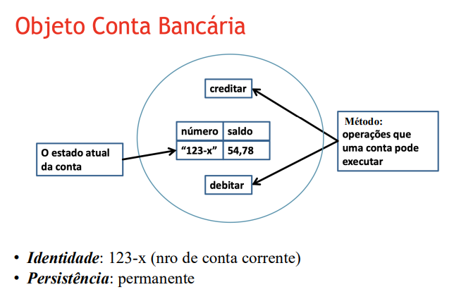

---

### Comunicação entre Objetos
- A comunicação entre objetos ocorre por meio de **mensagens**. Essas mensagens são, na prática, a ativação de um método de um objeto por outro. 

Uma mensagem define três elementos principais:
* **Nome do serviço requisitado**: Corresponde ao nome do método que está sendo chamado. 
* **Informação necessária**: São os parâmetros enviados para que o método possa ser executado.
* **Nome do requisitante**: É o objeto que está realizando a chamada do método. 

---
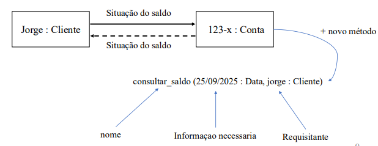

---


### Classes
#### O que é uma classe?

- Objetos de um mesmo tipo possuem os mesmos comportamentos.
- Objetos de um mesmo tipo pertencem à mesma classe.
- Uma classe é um tipo a partir do qual objetos são criados.
- A classe define:
    - Os elementos que os objetos contêm (**atributos**).
    - O comportamento que os objetos possuem (**métodos**).
    - A maneira como esses elementos de dados e métodos podem ser acessados (**interface**).

---
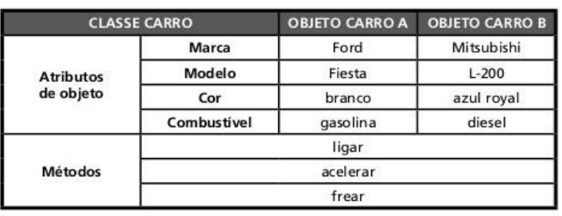

---

> Classe é diferente de objeto.
- Ela Representa uma abstração de objeto
> Contém toda a descrição da forma do objeto como:
- Um molde para a criação do objeto
- Uma matriz geradora de objetos
- Uma fábrica de objetos


#### Atributos

- **Atributos de classe (coletivos):**
    - Mesmo valor inicial para todos os objetos criados (valor padrão).
    - Valor armazenado na classe.
    - Área de memória compartilhada por todos os objetos da classe.
- **Atributos de objeto (individuais):**
    - Armazenados individualmente em cada objeto.
    - Cada objeto pode definir um valor inicial próprio.
    - Área de memória reservada individualmente para cada objeto.

#### Métodos

- Comportamentos, ações e reações dos objetos.
- Funções ou serviços fornecidos pelo objeto para outros objetos.
- Podem manipular os atributos do objeto (alterando seu estado).

**Exemplos:**
- Um automóvel tem o comportamento de se locomover.
- Um computador processa programas.
- Um método de conversão de uma imagem colorida para tons de cinza altera o estado da imagem, convertendo cada pixel colorido em cinza.

### Representação Uml de Classes
- As classes são representadas por retângulos divididos em três partes:
    - Nome da classe (parte superior)
    - Atributos (parte do meio)
    - Métodos (parte inferior)
- Ex:
````
+---------------------+
|       Pessoa        |
+---------------------+
| - nome: String      |
| - idade: Integer    |
+---------------------+
| + fazerAniversario()|
| + apresentar(): String|
+---------------------+
````    
- **Visibilidade dos atributos e métodos:**
    - `+` Público: acessível por qualquer objeto.
    - `-` Privado: acessível apenas dentro da própria classe.
    - `#` Protegido: acessível dentro da classe e suas subclasses.
    - `~` Pacote: acessível dentro do mesmo pacote (ou namespace).

---
### Diagramas de classes
---
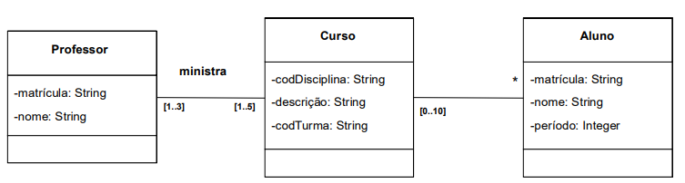

---

### Diagramas de Objetos

- Mostram uma “fotografia” do sistema OO em execução.
- Apresentam objetos, valores de atributos e ligações entre eles.

## Análise Orientada a Objetos (AOO)

A Análise Orientada a Objetos (AOO) é uma abordagem utilizada para identificar e organizar os elementos principais de um sistema, facilitando o desenvolvimento de software baseado em objetos.

### Objetivo Básico

- Identificar classes que serão usadas para representar objetos como instâncias no sistema.

### Principais Tarefas

1. **Identificação de Objetos e Classes:** Descobrir quais entidades do domínio podem ser representadas como objetos ou classes.
2. **Especificação de Atributos:** Definir as características (atributos) que cada classe ou objeto deve possuir.
3. **Definição de Métodos e Comunicação:** Determinar os comportamentos (métodos) e como os objetos irão interagir entre si.

---

## Identificação de Objetos e Classes

Durante a análise, é importante considerar diferentes tipos de entidades que podem ser transformadas em objetos ou classes:

- **Entidades externas:** Outros sistemas, dispositivos, pessoas.
- **Itens do domínio do problema:** Relatórios, displays, documentos.
- **Ocorrências ou eventos:** Conclusão de tarefas, alarmes, cliques de mouse.
- **Papéis ou funções:** Engenheiro, gerente, vendedor (funções desempenhadas por pessoas).
- **Unidades organizacionais:** Grupos, equipes, departamentos.
- **Lugares:** Piso de fábrica, áreas específicas.
- **Estruturas:** Sensores, veículos, equipamentos.

---

## Dicas para Identificação

- Ao analisar os requisitos, **nomes** citados frequentemente podem indicar potenciais objetos ou classes.
- Compreender o contexto e as necessidades do usuário é essencial para classificar corretamente possíveis objetos e métodos.

---
#### AOO: Especificação de classes


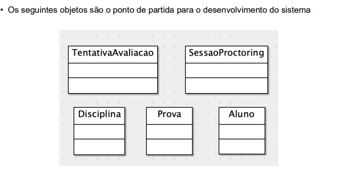

---
#### AOO: Especificação de Atributos

### Atributos

- Representam o conjunto de características (estado) dos objetos daquela classe.
- **Visibilidade:**
    - `+` Público: visível em qualquer classe de qualquer pacote.
    - `#` Protegido: visível para classes do mesmo pacote.
    - `-` Privado: visível somente para a própria classe.
---

### AOO: Especificação de Métodos
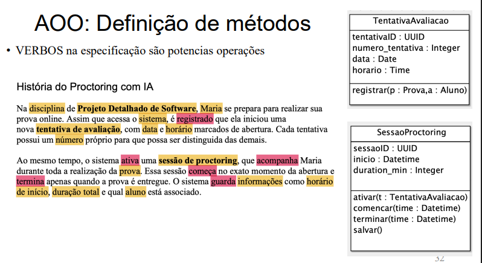

---
### Diagramas de comunicação 
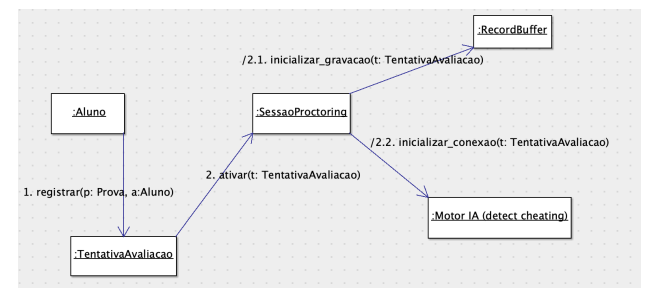

---
### AOO: Definição dos Relacionamentos
- **Generalização**
- Representa a herança entre classes
- Filhos compartilham estrutura e comportamento do pai
- Filhos são substituíveis por pais

---
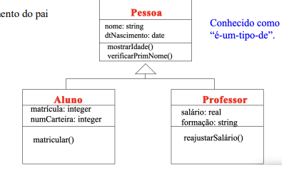

---
- **Associação**
- Representa um relacionamento estrutural entre classes
---
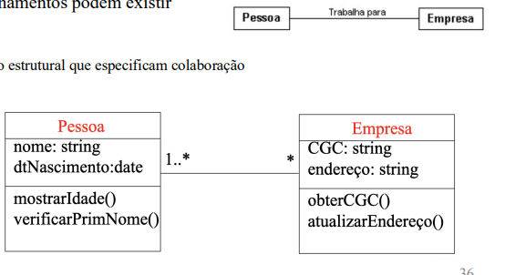

---


### Detalhes:
### Relacionamentos de Associação

Os relacionamentos de associação entre classes possuem alguns elementos básicos:

- **Nome:** Descreve a natureza do relacionamento entre as classes.
- **Papel:** Indica o papel desempenhado por cada classe no relacionamento.
- **Multiplicidade:** Define quantos objetos de uma classe podem estar associados a objetos da outra classe.
    - O valor padrão é muitos (`0..*`), mas pode ser:
        - Um ou mais (`1..*`)
        - Exatamente um (`1`)

---
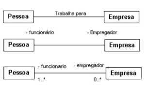
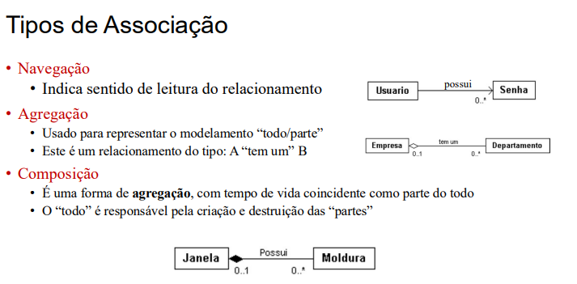

---

### Relecionamnentos de dependência
- Representa um relacionamento de uso entre classes.
- Uma classe depende de outra se usa seus serviços.
- Indicado por uma linha tracejada com uma seta apontando para a classe da qual depende.

---
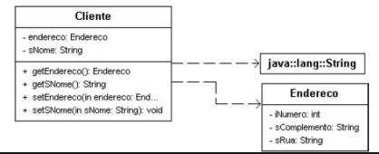

---
### Interface

- Uma **interface** define um contrato entre uma classe e o mundo exterior.
- Ao implementar uma interface, a classe se compromete a fornecer o comportamento especificado por ela.
- Interfaces são compostas por declarações de um ou mais métodos, que **não possuem corpo** (apenas a assinatura).
- As operações específicas de cada método são implementadas pela classe que adota a interface.
- Interfaces permitem padronizar comportamentos e facilitar a comunicação entre diferentes partes do sistema.
- Exemplo em UML:  
    ```
    <<interface>>
    + metodo1()
    + metodo2()
    ```

---
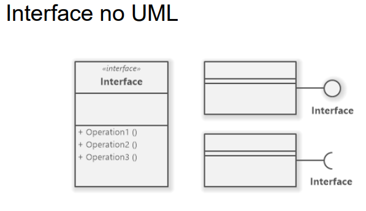
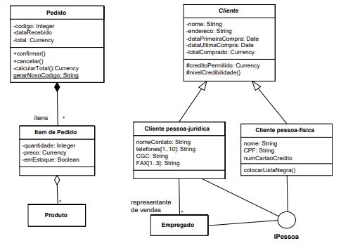

---

### Relecionamnentos de Realização
- Indica que um comportamento é implementado por outra classe.
- Mistura entre dependência e generalização.
- Uma interface é sempre realizada por uma classe.

---