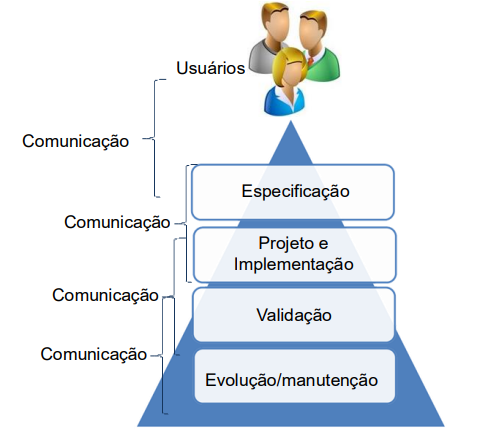
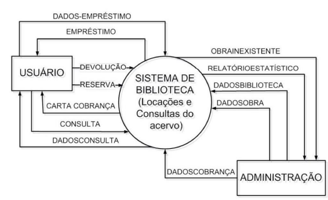

## Modelagem de Software
### Motivação:
* **Modelos de Sistema/Software** → Representações do sistema (ex.: modelo de classes, casos de uso).

* **Modelos gráficos e notações** → Diagramas e símbolos usados para representar o sistema (ex.: UML).

* **Restrições** → Regras/limitações que os modelos devem seguir (ex.: requisitos obrigatórios, padrões técnicos).

* **Boas práticas de projeto** → Recomendações para deixar o sistema mais organizado, seguro e eficiente.

* **Atividades em ordem** → Passos que precisam ser seguidos (ex.: análise → projeto → implementação → testes).

* **Ferramentas** → Softwares que podem ser usados (ex.: IDEs, CASE, gerenciadores de versão).

- Um **processo de software** organiza **como desenvolver um sistema**, indicando **o que modelar, como representar, quais regras seguir, boas práticas, ordem das atividades e ferramentas de apoio**.

### Na construção de software você tem **Modelos**, mas por que?
* **Gerenciar a complexidade** → o sistema é grande, o modelo ajuda a organizar as ideias em partes menores.
* **Comunicação** → facilita a troca de informações entre desenvolvedores, clientes e gestores (todos entendem melhor).
* **Redução de custos** → encontrar erros no modelo é mais barato do que encontrar depois no código.
* **Prever o comportamento futuro** → simular ou imaginar como o sistema vai funcionar antes de construir de fato.

- Resumindo: **modelo é como um rascunho/protótipo** que ajuda a entender, planejar e guiar a construção do software sem gastar tanto tempo e dinheiro corrigindo depois.

#  O que são Modelos?
-  **Transformação de conhecimento tácito em conhecimento explícito!**
> Conhecimento tácito → é aquele que a pessoa tem na cabeça, mas não está escrito em lugar nenhum. Ex.: a experiência de um programador, a ideia que o cliente explica “de boca”, mas não está documentada.

> Conhecimento explícito → é quando esse saber é registrado de forma clara: em documentos, diagramas, modelos, regras. Ou seja, algo que qualquer pessoa pode acessar e entender.

* Modelos facilitam a comunicação entre as pessoas envolvidas.
* Seu trabalho será transformar:
  **Problemas do mundo real → necessidades → requisitos de software → modelos de software**

---

## Definições

* Um **modelo de software** é uma **abstração** do software em desenvolvimento.
* Não é apenas uma representação alternativa do software.
* Mantém todas as informações a respeito da entidade apresentada.
* **Simplifica a realidade**, realçando as características mais importantes.
* Existem diferentes tipos de modelos, cada um enfatizando um aspecto (ex.: funcionalidades, comportamento, dados).

---

## Vantagens de usar modelos

* Documentar decisões.
* Entender melhor o sistema.
* Guiar a implementação e outras fases do ciclo de vida.
* Ajudar na comunicação (o profissional de software gasta \~50% do tempo nisso).
* Facilitar a entrada de novas pessoas no projeto.

---

## Principais modelos de software

1. **Perspectiva externa**

   * **Modelo de contexto**

2. **Perspectiva de interação**

   * Casos de uso
   * Diagramas de sequência

3. **Perspectiva estrutural**

   * Classes, objetos, colaboração, componentes

4. **Perspectiva comportamental**

   * Diagramas de estados
   * Diagramas de atividades

---

## Modelo de contexto

* **Modelo estrutural** que mostra o ambiente do sistema e seus limites.
* Normalmente usado no início da especificação.
* Mostra quais outros sistemas fazem parte do ambiente, mas não mostra a natureza detalhada dos relacionamentos.
* Representado por **associações** → indicam que há relação entre entidades, sem detalhar como.
* Pode ser documentado com **diagramas de blocos simples**, mostrando entidades e associações.

### Exemplos de como sistemas externos se relacionam:

* Produzir dados para o sistema.
* Consumir dados do sistema.
* Compartilhar dados.
* Ser conectados diretamente por rede.
* Estar no mesmo local ou em locais separados.

---

## Ferramentas para construir modelos

* [Miro](https://miro.com/)
* [Draw.io](https://www.draw.io)

---

