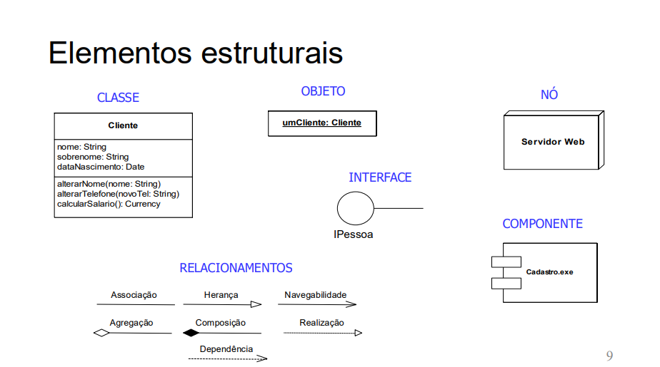
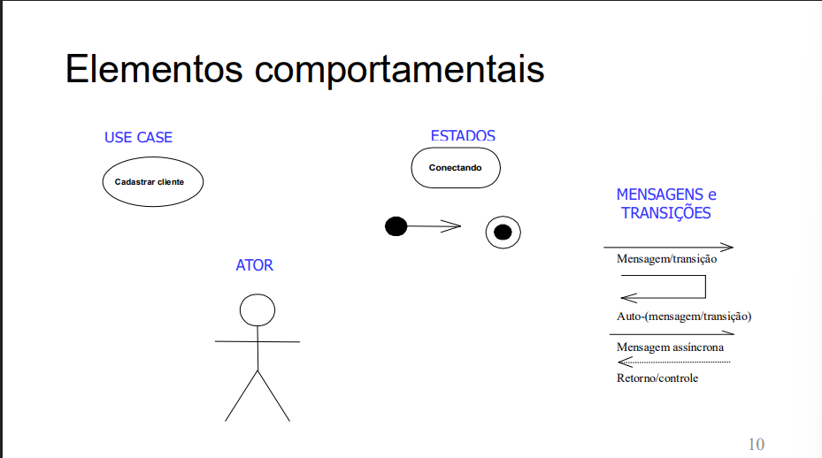

### **Introdução à UML (Unified Modeling Language) - linguagem visual**
### **O que é a Linguagem UML?** 
* **Definição**: UML é a sigla para Linguagem de Modelagem Unificada.

* **Propósito**: É uma linguagem visual projetada especificamente para a modelagem de software.

* **Aplicação**: É usada para criar modelos de processos do mundo real e também de processos em arquiteturas de software.

* **Funcionalidade**: A UML serve tanto para analisar os elementos que participam de um processo quanto para entender o comportamento desses elementos dentro do processo.

* **Abrangência**: Ela oferece elementos para modelar todas as etapas do desenvolvimento de um software.

### **Usos da UML**
* **Visualização**
* **Especificação**
* **Construção**
* **Documentação**
* **Comunicação**

**Importante**: Ela não dita os passos do desenvolvimento, mas sim fornece a linguagem para modelar dentro de um processo.

### Os elementos da UML são divididos em quatro categorias principais:

1.  **Elementos Estruturais**: São as "partes" estáticas do modelo.
    * **Classe**: Um modelo para criar objetos.
    * **Objeto**: Uma instância de uma classe.
    * **Interface**: Uma coleção de operações que especificam um serviço.
    * **Componente**: Uma parte física e substituível do sistema, como um arquivo `.exe`.
    * **Nó**: Um recurso computacional físico, como um servidor web.
    * **Relacionamentos**: Mostram como os elementos se conectam (Associação, Herança, Agregação, Composição, etc.).

> *Associação*: É a relação mais comum. Indica que objetos de uma classe se conectam a objetos de outra. Pense como "conhece um" ou "usa um".
- Exemplo: Um Professor está associado a uma Disciplina.

> Herança: É o relacionamento "é um tipo de". Uma classe filha (especializada) herda atributos e métodos de uma classe pai (geral).
- Exemplo: Carro é um tipo de Veículo.

> Agregação: É uma relação de "tem um" ou "parte-todo", mas as partes podem existir independentemente do todo. É representada pelo losango branco.
- Exemplo: Um TimeDeFutebol tem Jogadores. Se o time acabar, os jogadores continuam existindo.

> Composição: É uma agregação forte, uma relação de "parte-de". As partes não existem sem o todo. O todo é responsável por criar e destruir suas partes. É representada pelo losango preto.
- Exemplo: Uma Casa é composta por Paredes. Se a casa for demolida, suas paredes deixam de existir com ela.

> Dependência: É a relação mais fraca. Ocorre quando uma classe utiliza outra (por exemplo, como parâmetro em um método), mas não armazena uma referência permanente a ela. Uma mudança em uma classe pode afetar a outra.
- Exemplo: Uma classe Impressora depende da classe Documento para executar o método imprimir(Documento d).

> Realização: Como vimos acima, é a relação em que uma classe implementa uma interface, ou seja, cumpre o contrato definido por ela.

> Navegabilidade: A seta na ponta de uma associação indica o sentido da relação. Se um Pedido tem uma seta apontando para Cliente, significa que a partir de um objeto Pedido, eu consigo acessar o Cliente associado.
---

---

2.  **Elementos Comportamentais**: Descrevem como o sistema se comporta ao longo do tempo.
    * **Use Case (Caso de Uso)**: Descreve uma funcionalidade do sistema do ponto de vista do usuário (ex: "Cadastrar cliente").
    * **Ator**: Representa um usuário ou sistema externo que interage com o sistema.
    * **Estados**: Situações ou condições em que um objeto pode se encontrar (ex: "Conectando").
    * **Mensagens e Transições**: A comunicação entre os objetos.
---

---
3.  **Elementos de Agrupamento**: Servem para organizar o modelo.
    * **Pacotes**: Agrupam elementos relacionados para simplificar os diagramas (ex: "Interface gráfica", "Regras de negócio", "Acesso ao banco").
---

---

4.  **Elementos de Extensão e Anotação**: Permitem adicionar informações extras aos modelos[cite: 95, 96, 136].
    * **Anotação**: Um comentário ou nota explicativa no diagrama.
    * **Restrição (Constraint)**: Uma condição ou regra que deve ser mantida (ex: `{frozen}`).
    * **Estereótipo (Stereotype)**: Permite criar novos tipos de elementos UML ex: `<<importa>>`.
    * **Tagged Values**: Adicionam novas propriedades a um elemento (ex: `{autor=...}`).

### **Diagramas da UML**

A UML 1.x possui 9 diagramas, divididos em duas categorias principais:

* **Diagramas Estruturais (Visão Estática)**: Mostram a estrutura do sistema.
    * Diagrama de Classes 
    * Diagrama de Objetos 
    * Diagrama de Caso de Uso 
    * Diagrama de Componentes 
    * Diagrama de Implantação 

* **Diagramas Comportamentais (Visão Dinâmica)**: Mostram o comportamento do sistema.
    * Diagrama de Estados 
    * Diagrama de Atividades 
    * Diagrama de Colaboração 
    * Diagrama de Sequência 

### **Regras da UML**

* **Modelos Bem-Formados**: Para serem considerados bem-formados, os modelos devem ser semanticamente consistentes e estar em harmonia com outros modelos relacionados
.
* **Regras Essenciais**: Devem seguir regras de "nome", "escopo", "visibilidade", "integridade" e "execução".

* **Flexibilidade**: Durante o desenvolvimento, é comum que os modelos estejam parciais, incompletos ou até mesmo inconsistentes.