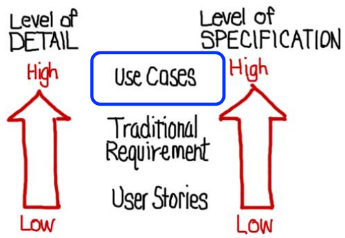
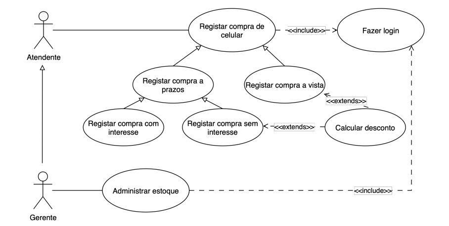

## Detalhamento dos Requisitos

---
> User Stories (Histórias de Usuário):
- Nível de Detalhe: Baixo (Low). São curtas e simples.
- Nível de Especificação: Baixo (Low). Não entram em detalhes técnicos.
- Uso: Ideal para metodologias ágeis, focando na necessidade do usuário.

> Traditional Requirement (Requisito Tradicional):
- Fica em um nível intermediário entre as Histórias de Usuário e os Casos de Uso.

> Use Cases (Casos de Uso):
- Nível de Detalhe: Alto (High). Descrevem a interação passo a passo.
- Nível de Especificação: Alto (High). São mais formais e detalhados.
- Uso: Ideal para o desenvolvimento baseado em planos (tradicional), onde é preciso um documento completo antes de começar a programar.

### O que é um Caso de Uso?
- Definição: Casos de uso são modelos que descrevem como os usuários interagem com um sistema para realizar tarefas específicas.

- Objetivo: Descrevem, de forma clara, como o sistema deve se comportar a partir da interação com os usuários.

- Visão: Oferecem uma visão simplificada de uma interação, mostrando a funcionalidade do sistema do ponto de vista do usuário.

### Diagrama de Caso de Uso

### 1. **Atores**
* Representam **quem interage** com o sistema (pessoas, outros sistemas, dispositivos).
* Ex.: *Estudante, Professor, Administrador*.

### 2. **Casos de uso**
* São as **funcionalidades ou serviços** que o sistema oferece aos atores.
* Ex.: *Executar lição anterior, Gerenciar dicas, Registrar presença*.

### 3. **Relacionamentos entre estes**
* Mostram como atores e casos de uso se conectam.
* Ex.: O ator *Estudante* está ligado ao caso de uso *Executar lição anterior*.

### 4. **Associações**
* Linhas que ligam **atores** e **casos de uso**.
* Indicam que o ator participa daquela funcionalidade.

### 5. **Generalização entre atores**
* Mostra que um ator **herda o comportamento** de outro.
* Ex.: *Usuário* pode ser ator genérico, e *Estudante* e *Professor* herdam dele.

### 6. **Generalização, «extends» e «includes» entre os casos de uso**
* **Generalização** → um caso de uso genérico com versões especializadas.
* **«include»** → quando um caso de uso sempre **inclui outro** como parte da sua execução.
  * Ex.: *Executar lição anterior* **inclui** *Autenticar-se*.
* **«extend»** → quando um caso de uso pode ser **estendido opcionalmente** por outro.
  * Ex.: *Executar lição anterior* pode ser estendido por *Revisar dicas extras*.

### 7. **Limites do sistema**
* Representados por um **retângulo** que engloba os casos de uso.
* Dentro do retângulo → estão os casos de uso (funcionalidades).
* Fora do retângulo → ficam os atores que interagem com o sistema.

* Em resumo:
Um **diagrama de casos de uso** mostra:
* **Quem usa o sistema (atores)**,
* **O que o sistema faz (casos de uso)**,
* **Como se relacionam (associações, includes, extends, generalização)**,
* **E qual é o limite do sistema** (retângulo que engloba os casos de uso).

---
> Atores (Humano ou outro sistema): Simbolo de pessoa.

> Caso de uso (função): Simbolo de  um circulo achatado.

> Relacionamento de associação (entre ator e caso de uso): Simbolo de uma seta do ator para o caso.

> Relacionamento de associação (entre caso de uso e ator): Simbolo de uma seta do caso para o ator.

> Relacionamento de generalização (entre casos de uso): Simbolo de uma seta com ponta branca do caso A para o caso B. Isso idica que os casos de uso de B serão tbm os de A.
- ex do caso A: "Fazer pagamento com cartão"
- ex do caso B: "Fazer pagamento com cartão de crédito"

> Relacionamento de generalização (entre atores): Simbolo de uma seta com ponta branca do ator B para o ator B. Isso indica que os casos de uso de B serão tbm os de A.

> Entre os casos de uso << include >>: quando um caso de uso sempre **inclui outro** como parte da sua execução. Simbolo de um seta pontilhada do caso A para o B.
- Definição clara do < extends >: 

> Entre os casos de uso << estends >>: quando um caso de uso pode ser **estendido opcionalmente** por outro

> Retângo em torno dos casps de uso, pois limita o sistema, deixando os atores fora do retângulo sempre.

---

- Essa seta representa Generalização (ou herança).

- Ela indica que os casos de uso "filhos" (Registrar compra a prazos e a vista) são versões especializadas do caso de uso "pai" (Registrar 
compra de celular).

---

### obs: 
> **<< include >>**: Um caso de uso sempre chama outro, pois ele faz parte do fluxo principal.  

> **Include** = “sempre junto” (obrigatório).  

> **Exemplo:** *Comprar Passagem* → inclui *Validar Pagamento*.

> **<< extend >>**: Um caso de uso aproveita o comportamento de outro (o caso principal) e adiciona algo somente se uma condição acontecer.  

> **Extend** = “às vezes junto” (opcional/condicional).  

> **Exemplo:** *Emitir Nota Fiscal* → só acontece se o cliente pedir.

No exemplo acima, *Emitir Nota Fiscal* é um **extend** de *Comprar Produto*.

## Direção das setas:
- Associação: linha simples (sólida) entre o ator e o caso de uso.

- Generalização: linha com ponta de seta aberta (vazia) apontando para o ator ou caso de uso mais genérico.

- Include: linha pontilhada com ponta de seta aberta (vazia) apontando para o caso de uso incluído.

- Extend: linha pontilhada com ponta de seta aberta (vazia) apontando para o caso de uso que está sendo estendido.

- Seta apontando do ator A(pai) para o ator B(filho) indica que B herda os casos de uso de A.

- Seta apontando do caso de uso A(pai) para o caso de uso B(filho) indica que B herda os casos de uso de A.

1. **Include (<<include>>)**
   * **Direção da seta:** do **caso de uso base** para o **caso de uso incluído**.
   * Exemplo: `Fazer Pedido` **—>** `Validar Estoque` (com <<include>>).
     → Toda vez que alguém faz o pedido, o estoque **sempre** é validado.

2. **Extend (<<extend>>)**
   * **Direção da seta:** do **caso de uso que estende** para o **caso de uso base**.
   * Exemplo: `Aplicar Desconto Especial` **—>** `Fazer Pedido` (com <<extend>>).
     → O desconto só ocorre **em certas condições**, mas não é obrigatório no pedido.
