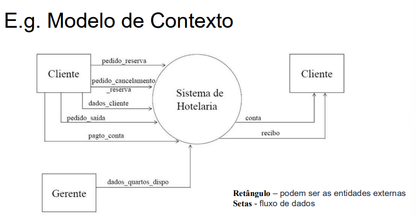
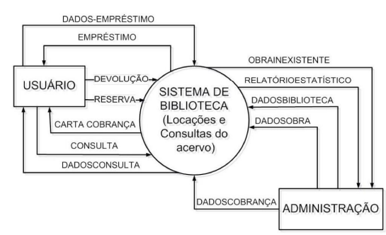

## Princípios de Software e Engenharia de Software
### Introdução à Engenharia de Software
> O que é Engenharia de Software?
+ Engenharia de software é uma disciplina relacionada com todos os aspectos da produção de software. E propõe ferramentas, técnicas e processos para:

- Entender com precisão qual é o problema (as necessidades associadas ao 
sistema que deve ser construído/modificado)

- Produzir uma solução adequada para esse problema (um sistema pronto para usar, levando-se em consideração as necessidades das partes interessadas)

- Levando-se em conta restrições de desenvolvimento e recursos disponíveis

### O que é Software?
- R: Software é um conjunto de programas de computador, dados e informações documentadas e associadas que ditam ao computador o que fazer. Podendo ser desenvolvido para um cliente específico ou para o mercado em geral.
> Programas de computador e artefatos associados
> Software podem ser
- Genéricos – desenvolvidos para serem vendidos para uma grande variedade de clientes (e.g., Excel e Word)
- Personalizados – desenvolvidos para um único cliente de acordo com as suas especificações

> Criados e desenvolvido por novos programas, pode haver configuração de um sistema genárico ou reutilização de um produto já existente, seja no mercado, seja dentro da própria empresa.

| **Atributo**                | **Descrição**                                                                                   |
|-----------------------------|-----------------------------------------------------------------------------------------------|
| Funcionalidade              | O software deve fornecer as funcionalidades requeridas para satisfazer as necessidades do usuário. |
| Facilidade de manutenção    | Deve ser fácil e barato evoluir o sistema após implantação para atender novas necessidades dos clientes. |
| Confiabilidade              | O software deve funcionar conforme sua especificação.                                          |
| Eficiência                  | O software deve usar o mínimo de recursos maximizando funcionalidade.                          |
| Usabilidade / Acessibilidade| O software deve ser compreensível e fácil de usar.                                             |

### O que é Processo de Software?
- Especificação
- Projeto
- Prototipação
- Validação
- Desenvolvimento
- Testes
- Implantação

- O processo de software abrange todas as atividades envolvidas no desenvolvimento de um produto de software. Ele consiste em um conjunto de atividades relacionadas, que podem incluir o desenvolvimento do software do zero em linguagens como Java ou C, ou ainda a extensão, modificação, configuração e integração de sistemas já existentes ou componentes de prateleira.

Apesar da variedade de processos de software, todos devem contemplar quatro atividades fundamentais:

1. **Especificação de software:** Definir claramente a funcionalidade do software e as restrições de seu funcionamento.
2. **Projeto e implementação de software:** Produzir o software conforme as especificações estabelecidas.
3. **Validação de software:** Garantir que o software atenda às necessidades e exigências do cliente.
4. **Evolução de software:** Adaptar e evoluir o software para acompanhar as mudanças nas necessidades dos clientes.

###  O que é **Modelo de Processo de Software**?
É tipo um **mapa** que mostra **a ordem das etapas** do desenvolvimento de software.

* Ele responde: **“O que deve ser feito e em que ordem?”**
* Exemplos:
  * **Cascata** → segue etapas lineares (requisitos → projeto → implementação → testes).
  * **Iterativo** → vai entregando em partes, repetindo ciclos.
  * **Baseado em componentes** → monta o sistema a partir de partes já prontas.

> Pense no **modelo** como o “formato do caminho” que o time vai seguir.

###  O que é **Método de Processo de Software**?

É mais **detalhado**: mostra **como fazer** cada etapa do modelo, com técnicas, práticas e regras.

* Ele responde: **“Como deve ser feito?”**
* Exemplos:
  * **Scrum** → reuniões diárias, papéis bem definidos (Product Owner, Scrum Master).
  * **XP (Extreme Programming)** → programação em par, testes automatizados.

- Pense no **método** como o “jeito de andar nesse caminho” (as práticas que guiam a equipe).

---

⚡ Resumindo em 1 frase:

* **Modelo** → define o **que** e **quando** fazer.
* **Método** → define **como** fazer.

### O que é CASE:
- Engenharia de Software Assistida por Computador.
- Em outras palavras, são ferramentas ou softwares criados para ajudar desenvolvedores e equipes a planejar, projetar, documentar, implementar e até testar sistemas de software.
> Ferramenta CASE = um “programa que ajuda a desenvolver programas”. Não substitui.

### Tipos de processos
+ Processos dirigidos a planos (tradicionais) todas as atividades do processo são planejadas com antecedência
- o progresso é medido em relação aos planos

+ Processo ágeis
- planejamento é incremental
- mais fácil modificar para refletir alterações nos requisitos do cliente

### Metodos de desenvolvimento ágeis - Os valores do manifesto ágil
- Indivíduos e interações mais que processos e 
- ferramentas Software em funcionamento mais que documentação abrangente 

- Colaboração com o cliente mais que negociação de contratos
- Responder a mudanças mais que seguir um plano

----

## Modelagem de Software
### Motivação:

- Um **processo de software** organiza **como desenvolver um sistema**, indicando **o que modelar, como representar, quais regras seguir, boas práticas, ordem das atividades e ferramentas de apoio**.

### Na construção de software você tem **Modelos**, mas por que?
* **Gerenciar a complexidade**
* **Comunicação**
* **Redução de custos**
* **Prever o comportamento futuro**

#  O que são Modelos?
-  **Transformação de conhecimento tácito em conhecimento explícito!**
> Conhecimento tácito → é aquele que a pessoa tem na cabeça, mas não está escrito em lugar nenhum. 

> Conhecimento explícito → é quando esse saber é registrado de forma clara: em documentos, diagramas, modelos, regras. Ou seja, algo que qualquer pessoa pode acessar e entender.

* Modelos facilitam a comunicação entre as pessoas envolvidas.
* Seu trabalho será transformar:
  **Problemas do mundo real → necessidades → requisitos de software → modelos de software**

## Definições

* Um **modelo de software** é uma **abstração** do software em desenvolvimento.
* Não é apenas uma representação alternativa do software.
* Mantém todas as informações a respeito da entidade apresentada.
* **Simplifica a realidade**.

## Principais modelos de software

1. **Perspectiva *externa***

   * **Modelo de contexto**

2. **Perspectiva de *interação***

   * Casos de uso
   * Diagramas de sequência

3. **Perspectiva *estrutural***

   * Classes, objetos, colaboração, componentes

4. **Perspectiva *comportamental***

   * Diagramas de estados
   * Diagramas de atividades

---

## Modelo de contexto

Um **modelo de contexto** é uma representação visual ou textual que descreve o ambiente no qual o sistema de software está inserido, destacando seus limites e as entidades externas com as quais interage. Ele mostra como o sistema se conecta a outros sistemas, organizações ou usuários, sem detalhar os relacionamentos internos. 

* Normalmente usado no início da especificação.
* Não mostra a natureza detalhada dos relacionamentos.

---