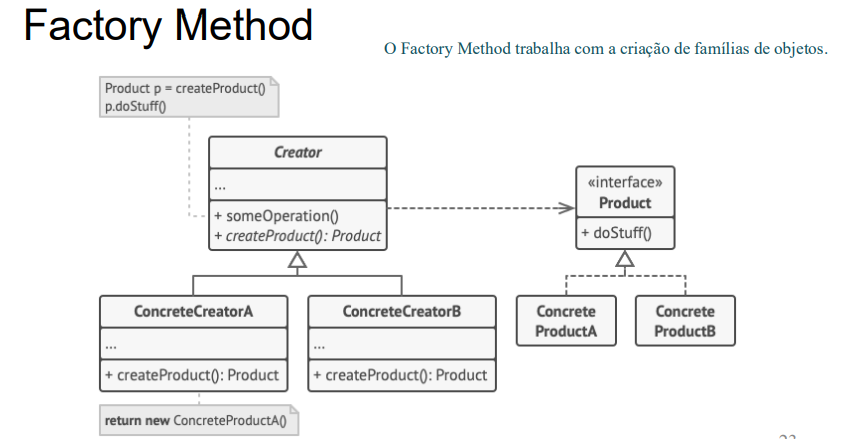
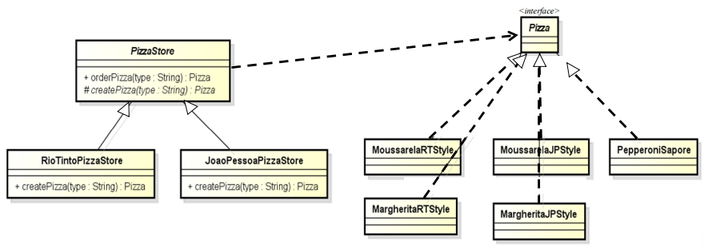
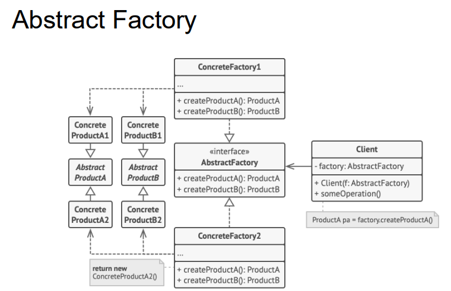
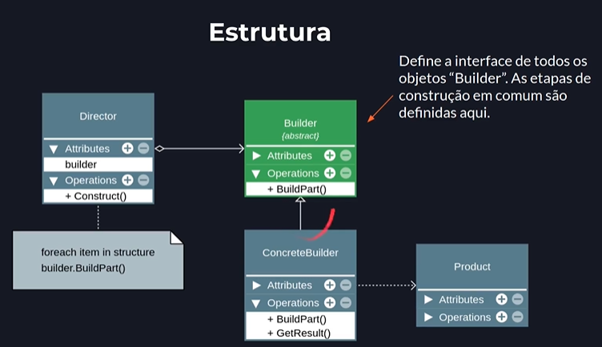
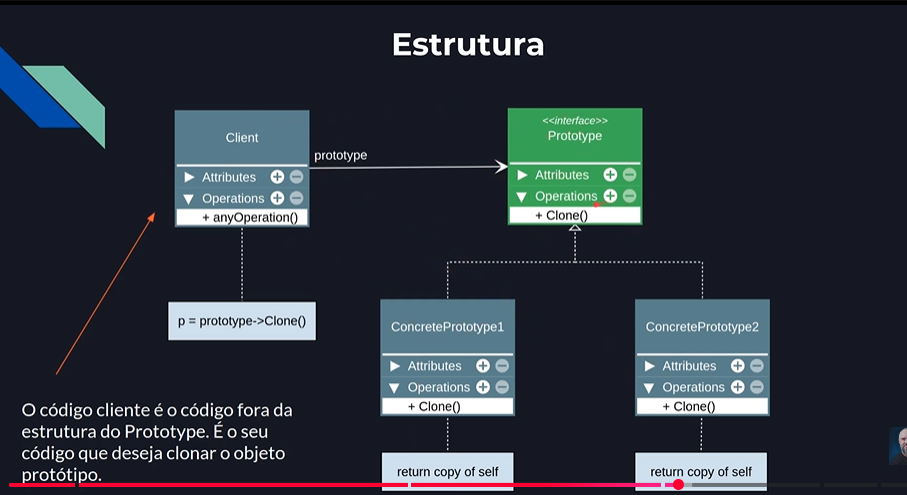

## Padroes de projetos criacionais
- Padrões de projeto são como um catálogo de soluções para problemas comuns que ocorrem repetidamente no desenvolvimento de software.
- Melhora a qualidade e a confiabilidade do software.
- Economiza tempo e esforço, pois evita que você precise "reinventar a roda".

### 2. Tipos de Padrões
- Os padrões do GoF são divididos em três categorias principais, de acordo com seu propósito:

- *Criacionais*: Focados em como os objetos são criados. O objetivo é dar mais flexibilidade ao sistema, decidindo quais objetos criar para cada caso. (Ex: Factory Method, Abstract Factory, Singleton, Builder, Prototype) .

- *Estruturais*: Focados em como classes e objetos são compostos para formar estruturas maiores. (Ex: Adapter, Decorator, Facade) .

- *Comportamentais*: Focados na comunicação e na atribuição de responsabilidades entre os objetos. (Ex: Observer, Strategy, Command) .

#### Padrões Criacionais
- Os padrões criacionais abstraem o processo de criação de objetos, ajudando a tornar um sistema independente de como seus objetos são criados, compostos e representados.

##### O Padrão Factory Method
- O padrão Factory Method define uma interface para criar um objeto, mas permite às classes decidir qual classe instanciar. O Factory Method permite adiar a instanciação para subclasses.

- Factory: cria um obj.
- O método fábrica é responsável por instanciar as classes desejadas.
- Obtido por herança.

- Estrutra a seguir.
---

- ConcreteProduct: retorna a interface Product.
- Creator: Declara o factory method, que retorna um objeto do tipo Product. Pode também definir uma implementação padrão do factory method que retorna um objeto de uma classe ConcreteProduct padrão.

---

---
##### O Padrão Abstract Factory
- O padrão Abstract Factory fornece uma interface para criar famílias de objetos relacionados ou dependentes sem especificar suas classes concretas.
- Abstract Factory: cria famílias de objs.
- O método fábrica é responsável por instanciar as classes desejadas.
- Composto por factory methods.
- Sepapara o codigo de criação do codigo que usa os objs.
- Foco na interface.

- Estrutra a seguir.
---

---

- ConcreteFactory: Implementa a interface AbstractFactory, criando objetos concretos.
- AbstractFactory: Declara uma interface para criar objetos abstratos.
- Client: Usa apenas interfaces declaradas pelas AbstractFactory e AbstractProduct classes.

- Definição resumida de abstract factory é "fábrica de fábricas".

---
| Característica | Factory Method | Abstract Factory |
|---|---:|---:|
| Objetivo | Criar um único produto | Criar uma família de produtos |
| Base | Método abstrato em uma classe base | Interface para múltiplos produtos |
| Expansão | Adicionar novos produtos requer criar uma nova subclasse | Adicionar novas famílias requer criar uma nova fábrica |
| Exemplo | Criar um tipo específico de documento (Texto ou Planilha) | Criar um conjunto de componentes (Botão e Janela) |

##### O padrão Builder
- O padrão Builder separa a construção de um objeto complexo da sua representação, permitindo que o mesmo processo de construção crie diferentes representações.
- Builder: constrói um objeto complexo passo a passo.
- Sepapara o codigo de criação do codigo que usa os objs.
- Pense nele como encomendar um computador personalizado online. Em vez de ter um único construtor com uma lista enorme e confusa de parâmetros, você segue um processo passo a passo:

> Primeiro, você escolhe o processador.

> Depois, escolhe a memória RAM.

> Em seguida, escolhe o armazenamento.

> Por fim, clica em "Montar Computador".

---

---
Builder: Declara os passos para construir o produto.

Director: Define a ordem de construção usando o Builder.

ConcreteBuilder: Implementa os passos para construir o produto específico.

Product: O objeto complexo que está sendo construído.

##### O Padrão Prototype
- O padrão Prototype especifica os tipos de objetos a serem criados usando uma instância prototípica e cria novos objetos copiando esse protótipo.
- Prototype: declara uma interface para clonar a si mesmo.
- Permite criar novos objetos pela cópia de um objeto existente (protótipo).

---

---