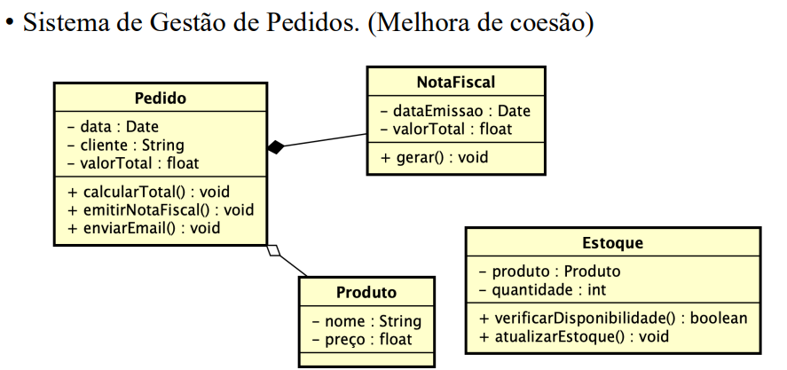
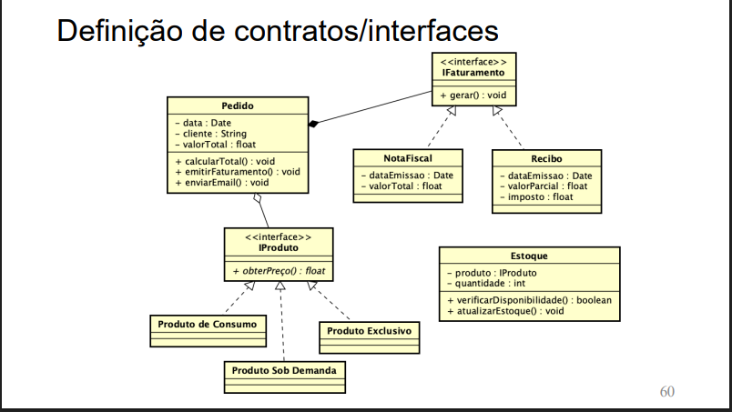

### Principios SOLID
### Princípios de Projeto de Software
> Coesão
- Ligado ao princípio da responsabilidade única
- Uma classe deve ter apenas uma única responsabilidade e realizá-la de maneira satisfatória, ou seja, uma classe não deve assumir responsabilidades que não são suas;
---

---
> Acoplamento

- Refere-se ao grau de dependência entre módulos ou classes.
- Significa o quanto uma classe depende da outra para funcionar;
- Classes difíceis de aproveitar tendo em vista que sempre que esta for utilizada todas as outras das quais ela depende devem estar presentes;
- Mudanças díficeis.
- Na imagem anterior temos acoplamento forte entre pedido e notafiscal e produto.

### Alta coesão e baixo acoplamento
- Alta coesão: Cada classe tem uma responsabilidade bem definida e única.
- Baixo acoplamento: As classes interagem entre si de forma mínima e independente. Põem-se interfaces para reduzir dependências diretas. Mas a dependência ainda existe, so que agora com as interfaces.
> Solução: Interfaces.

---

---