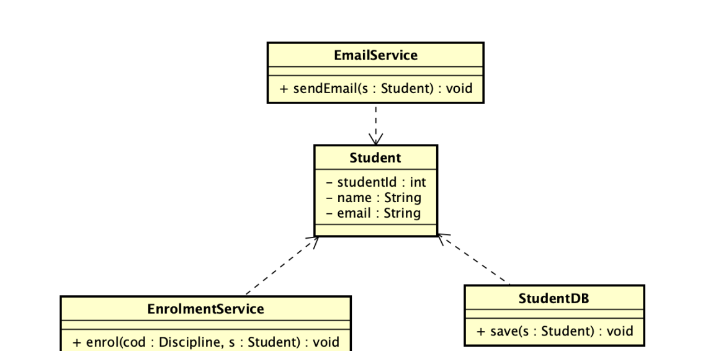
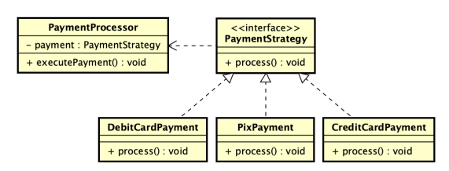

## Principios SOLID 02
- Princípios a serem aplicados em projetos orientados a objetos de forma a criar softwares “sólidos” - fáceis de criar, manter, estender e refatorar.

### **Single Responsibility Principle** (Princípio da Responsabilidade Única)
- Uma classe deve ter apenas um motivo para mudar, ou seja, deve ter apenas uma única responsabilidade.
- Se uma classe tem muitas responsabilidades divida a-a em classes menores, cada uma com uma responsabilidade única.
>Antes a classe estudante estava cheia de metodos. 
---

---

### **Open-Close Principle** (Princípio do Aberto/Fechado)
- Uma classe deve estar aberta para extensão, mas fechada para modificação.
- Isso significa que devemos ser capazes de adicionar novos comportamentos a uma classe sem alterar seu código-fonte existente, geralmente através de herança ou composição.

---

---

### **Liskov Substitution Principle** (Princípio de Substituição de Liskov)
- Objetos de uma classe derivada devem poder substituir objetos da classe base sem alterar as propriedades desejáveis do programa (correção, desempenho, etc.).
- De forma clara: uma subclasse deve ser substituível por sua superclasse.
- Isso significa que uma classe filha (subclasse) deve poder substituir sua classe mãe (superclasse) sem quebrar o código.

### **Interfaces Segregation Principle** (Princípio da Segregação de Interfaces)
- é melhor ter várias interfaces pequenas e coesas do que uma interface grande com métodos que algumas classes não precisam.

### **Dependency Inversion Principle** (Princípio da Inversão de Dependência)
- Módulos de alto e baixo nível devem depender de abstrações.
- O DIP fala sobre como as classes se relacionam entre si.

> Classes de alto nível → são as que contêm a lógica principal do sistema (ex: regras de negócio).

> Classes de baixo nível → são as que executam tarefas específicas, como acessar banco de dados, enviar e-mail, ler arquivo etc.

- O erro comum é o módulo de alto nível depender diretamente de um módulo de baixo nível.

> Aplicando o DIP corretamente

- Criamos uma abstração (interface) para o banco de dados.
- Fazemos as implementações concretas dependerem dela.
- A classe de alto nível também depende da abstração, não da implementação.

