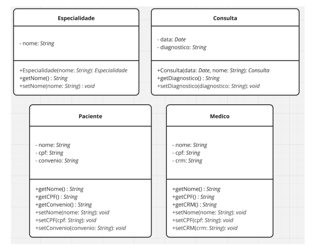
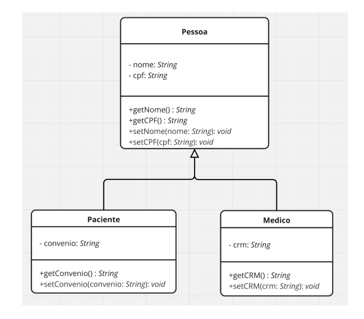
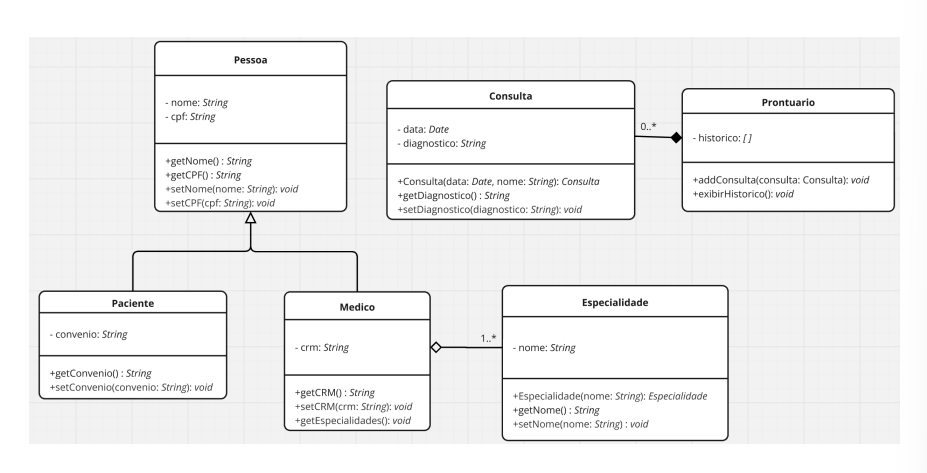
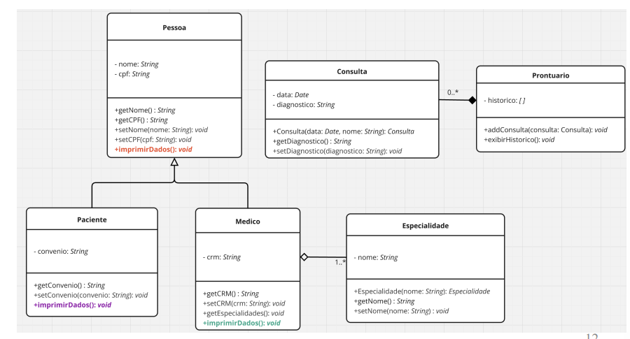
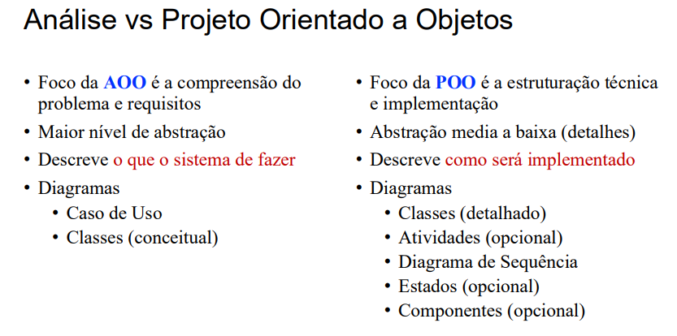
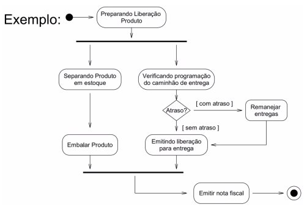
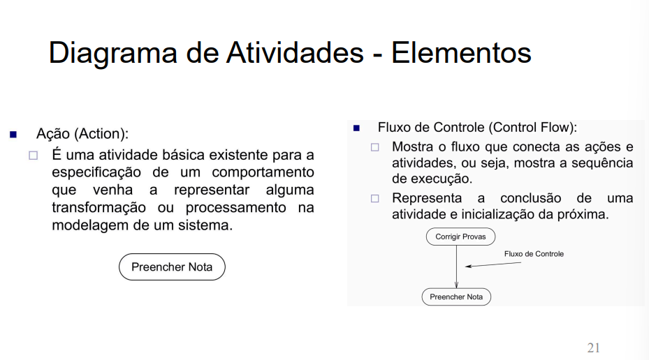
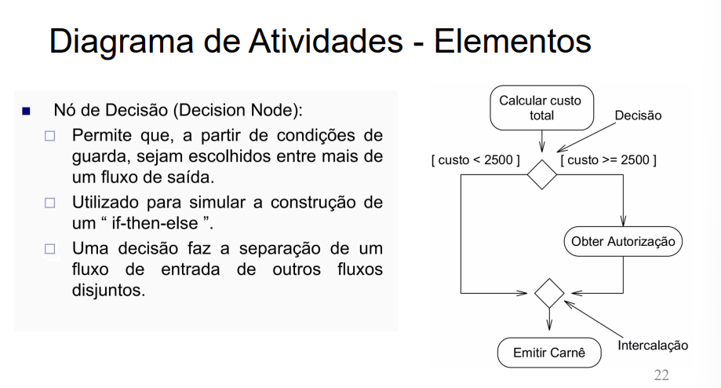
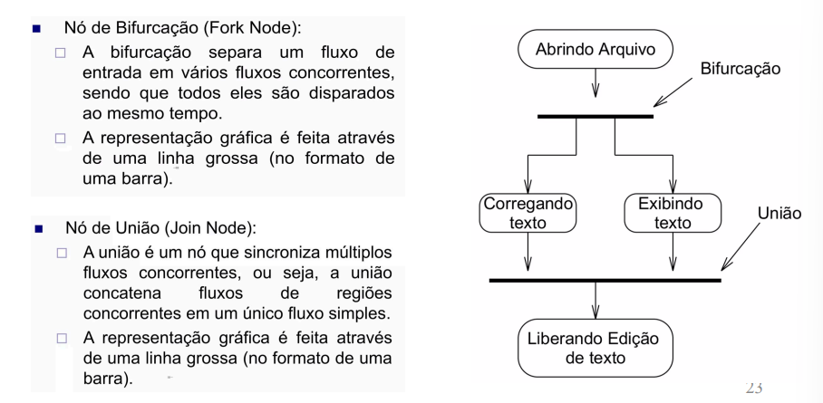
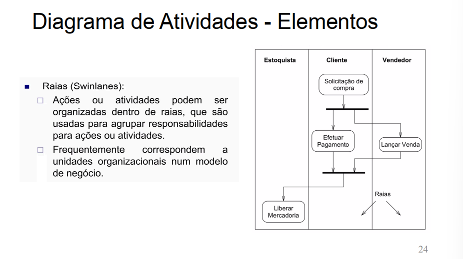

## Princípios e Projeto Orientado a Objetos
### Encapsulamento
- Encapsulamento de informações é esconder todos os membros de uma classe, além de esconder como funcionam as rotinas (no caso métodos) do nosso sistema.
- É fundamental para que seu sistema seja suscetível a mudanças:
    - Não precisaremos mudar uma regra de negócio em vários lugares, mas sim em apenas um único lugar, já que essa regra está encapsulada.
- As informações só devem estar visíveis para quem deve vê-las.
- O encapsulamento envolve diversos aspectos e técnicas, tais como:
    - **Modificadores de acesso**: visibilidade de atributos e métodos.
    - **Métodos SET e GET**: para acesso às propriedades.
    - **Construtores**: para instanciar objetos das classes.

---

---

### Herança

- Captura o que é comum e o isola daquilo que é diferente.
- **Propósito**:
    - Reutilização de funcionalidades.
    - Aproveitamento de código.
- Atributos, conexões e métodos comuns vão na superclasse (generalização).
- Adicionamos mais dessas coisas nas subclasses (classes de especialização).
- A herança é vista diretamente no código.

---

---

### Composição

- Composição é o princípio pelo qual um objeto é composto por um ou mais objetos de outras classes.
- É um relacionamento "todo-parte" (relação forte) ou "tem-um” (relação fraca).
- Em agregação (relação fraca), os componentes podem existir independente do objeto-contêiner.
- Diferente da herança, onde as classes compartilham comportamentos, a composição foca em combinar funcionalidades para modelar situações onde um objeto não faz sentido sem suas partes.

### Agregação (o "tem um")

**Símbolo:** `◇` (um losango branco/vazio na classe que contém a outra).

* "Uma universidade **tem** estudantes, mas se a universidade fechar, os estudantes continuam existindo." (relação fraca)

### Composição (o "é parte de")

**Símbolo:** `◆` (um losango preto/preenchido na classe que contém a outra).

* "Uma casa **é composta por** quartos, e se a casa for demolida, os quartos deixam de existir com ela." (relação forte, de vida ou morte)

---

---

### Polimorfismo

- Polimorfismo significa ter ‘muitas formas’.
- Denota uma situação na qual um objeto pode se comportar de maneiras diferentes ao receber uma mensagem, dependendo do seu tipo de criação.
- É o princípio pelo qual duas ou mais classes derivadas de uma mesma superclasse podem invocar métodos que têm a mesma identificação, assinatura, mas comportamentos distintos, especializados para cada classe derivada.
- Um único nome representando um código diferente, selecionado por algum mecanismo automático. “Um nome, vários comportamentos”.

---

---

## Projeto Orientado a Objetos
Consiste em definir a estrutura interna das classes, métodos, interfaces, padrões de
design e a interação entre os objetos para implementar a solução.
-  Objetivo:
-  Transformar o modelo da análise orientado a objetos em uma solução técnica
-  Pergunta-chave: Como o sistema deve ser implementado?
-  Inclue decisões sobre herença, polimorfismo, encapsulamento e design de padrões

---

---

## Diagrama de atividades
- Descreve o fluxo de atividades que ocorrem no sistema em determinado período.
- Pode ser utilizado para representar o funcionamento completo de um caso de uso ou a implementação de uma operação específica.

---

---
- Obs: Vertical Swimlane: é um retangulo representando as entidades para distinguir as partes envolvidas.
