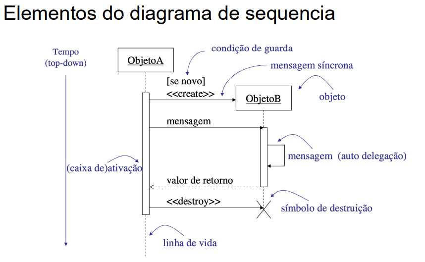
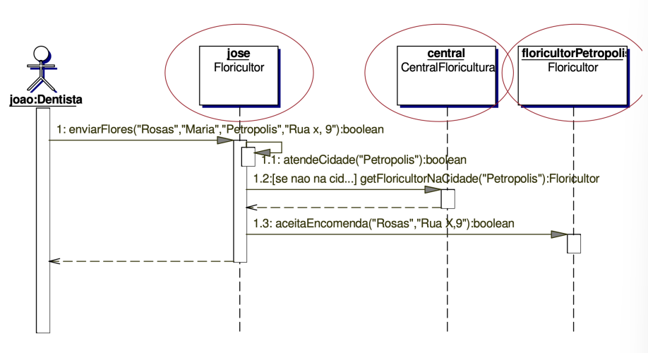
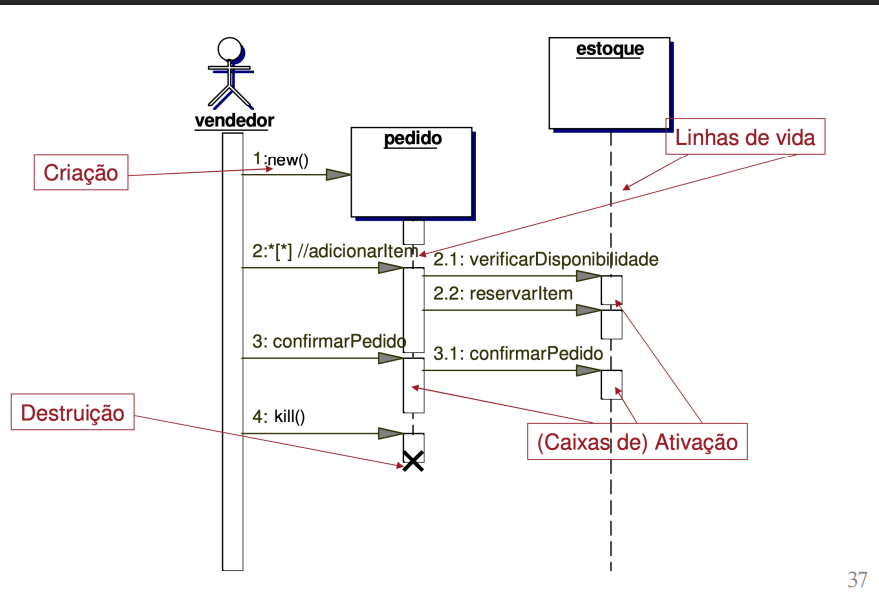
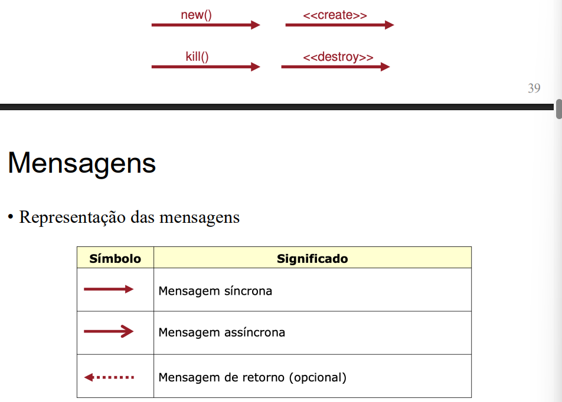
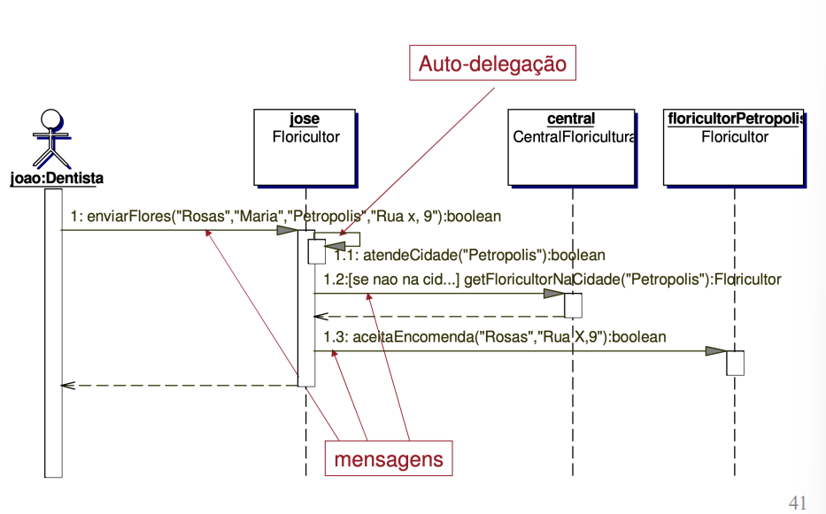
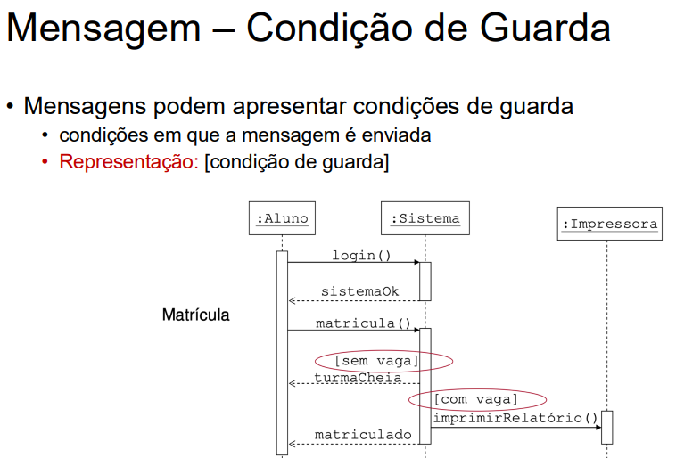
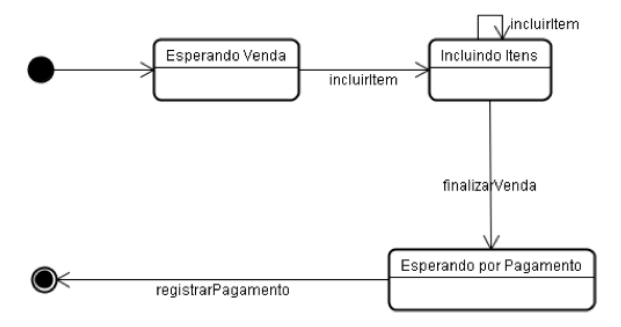

## Princípios e Projeto Orientado a Objetos
### Diagrama de Sequência

O diagrama de sequência mostra a interação entre objetos ao longo do tempo, sendo utilizado para representar o comportamento dos objetos em um determinado contexto, geralmente relacionado a um caso de uso. Ele destaca a ordem temporal das interações, exibindo as linhas de vida dos objetos e as mensagens trocadas entre eles durante a execução.

---



---

#### Objetos no Diagrama

- Os objetos aparecem alinhados horizontalmente no topo do diagrama.
- A ordem em que eles são colocados na horizontal não altera o significado, mas uma disposição clara facilita a leitura.
- Cada objeto é identificado por um nome, geralmente no formato `obj:Classe`.
    - Exemplos:
        - `joão:Dentista` (um objeto chamado joão da classe Dentista)
        - `:Floricultor` (um objeto da classe Floricultor sem nome específico)
        - `obj1:` (um objeto sem classe definida)

---



---

#### Linhas de Vida

- A linha de vida de cada objeto é representada verticalmente abaixo do seu nome.
- Ela indica o período em que o objeto existe e pode participar das interações.
- Caixas de ativação (retângulos sobre a linha de vida) mostram quando o objeto está ativo, ou seja, executando alguma ação.
    - Caixas separadas indicam operações independentes.
    - Caixas sobrepostas mostram que o objeto permanece ativo, aguardando uma resposta de outro objeto.
    - Também é possível indicar chamadas de métodos do próprio objeto.
- O diagrama pode mostrar a criação e destruição de objetos, tornando o fluxo de interações ainda mais claro.

---


---

#### Mensagens

- Objetos interagem através da troca de mensagens.
- As mensagens são representadas por setas sólidas que vão do objeto solicitante para o solicitado.
- Quando um objeto envia uma mensagem para si mesmo, ocorre uma auto-delegação.
- As mensagens são rotuladas com o nome do estímulo e seus argumentos (ou valores dos argumentos).
- **Sintaxe:**
    ```
    retorno := mensagem(parâmetro:TipoParâmetro):TipoRetorno
    ```
    - `retorno`: nome do valor de retorno.
    - `mensagem`: nome da mensagem.
    - `parâmetro`: nome de um parâmetro da mensagem.
    - `TipoParâmetro`: tipo do parâmetro.
    - `TipoRetorno`: tipo do valor de retorno.

> Tipo de Mensagens

- call: Invoca uma operação sobre um objeto
- Objeto pode mandar uma chamada para si próprio
- Resultando na execução local de uma operação
- return (opcional): Representa o retorno de um valor para o objeto que chamou
- create: Criação de um objeto
- destroy: Eliminação de um objeto
---




---

### Diagramas de Estados

**O que é:**
Diagrama que mostra **os estados de um objeto ou sistema** e **como ele muda de estado por eventos**. Parte da UML, usado para modelar **comportamento dinâmico**.

**Componentes principais:**

* **Estado inicial:** círculo preto.
* **Estado final:** círculo com outro dentro.
* **Estado intermediário:** retângulo arredondado.
* **Transição:** seta que liga estados (provocada por evento).
* **Eventos:** causas que mudam o estado (ex.: clique, mensagem).
* **Ações:** executadas ao entrar, sair ou permanecer no estado.

**Por que usar:**

* Entender **comportamento dinâmico** do sistema.
* Modelar sistemas **reativos** ou com **fluxos complexos**.
* Base para **implementação e testes**.

**Exemplo simplificado – Caixa eletrônico (ATM):**

* **Desligado → Ligado** (`ligar()`)
* **Ligado → Autenticando** (`inserirCartao()`)
* **Autenticando → Seleção de operação** (`senhaCorreta()`)
* **Seleção → Processando operação** (`selecionarSaque()`)
* **Processando → Ejetando cartão** (`retirarCartao()`)
* **Ejetando → Desligado**

---


---

### Princípios de Projeto de Software
