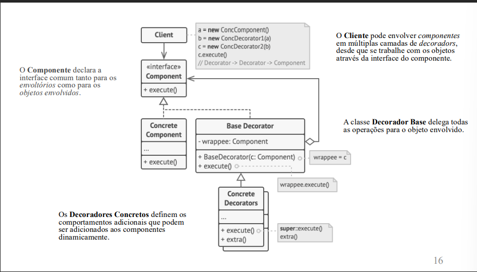
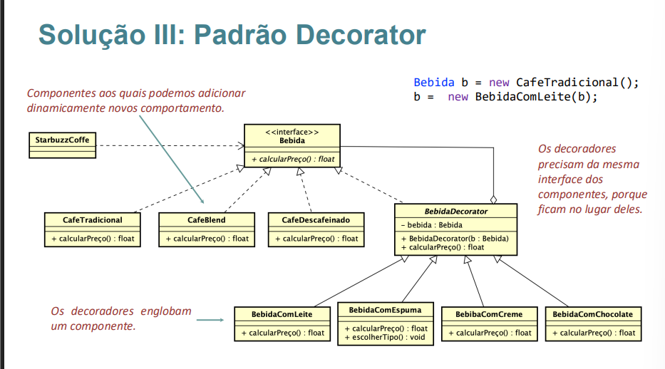
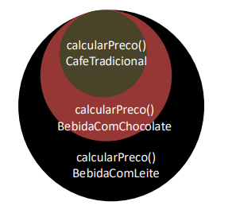
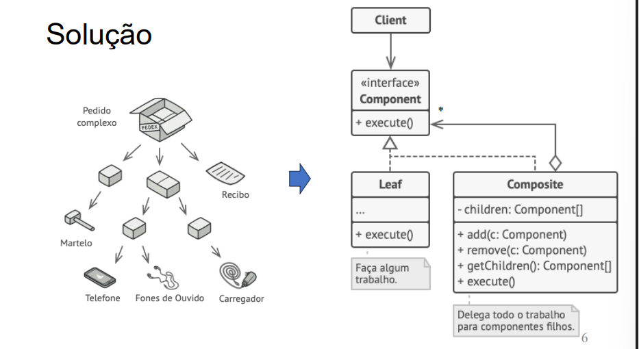
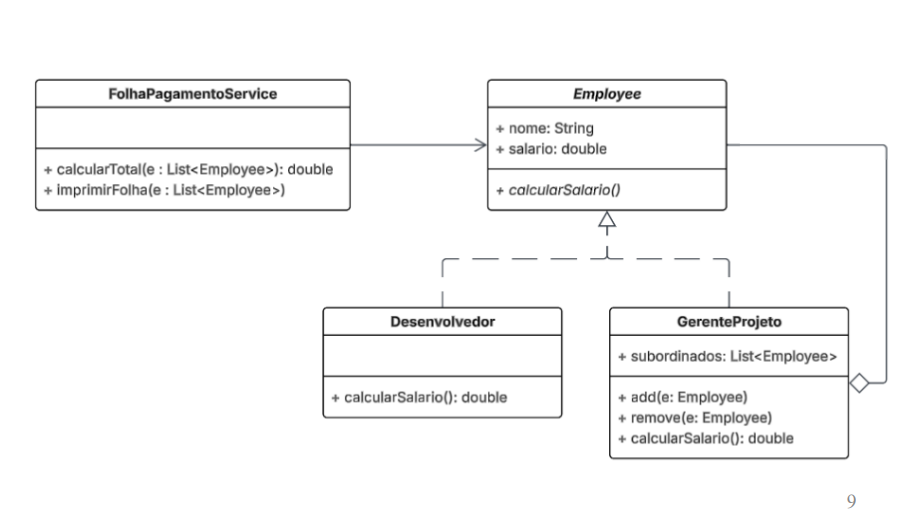
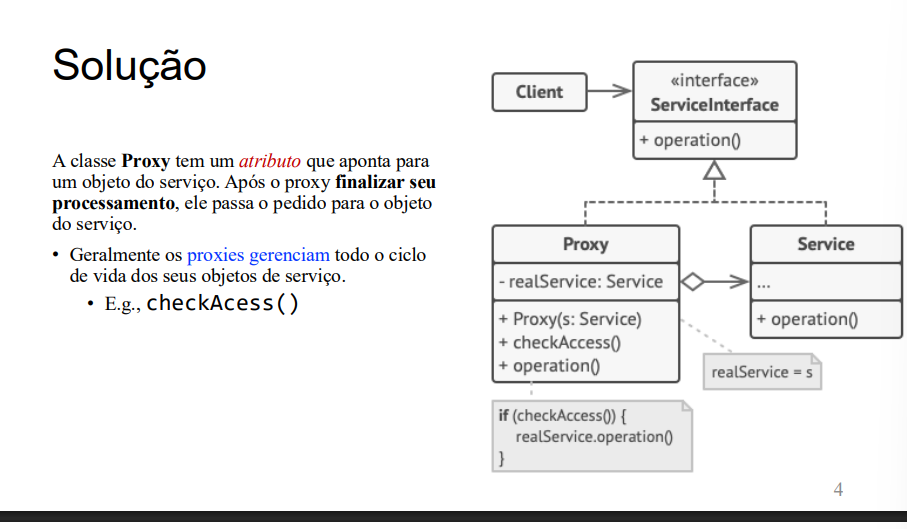
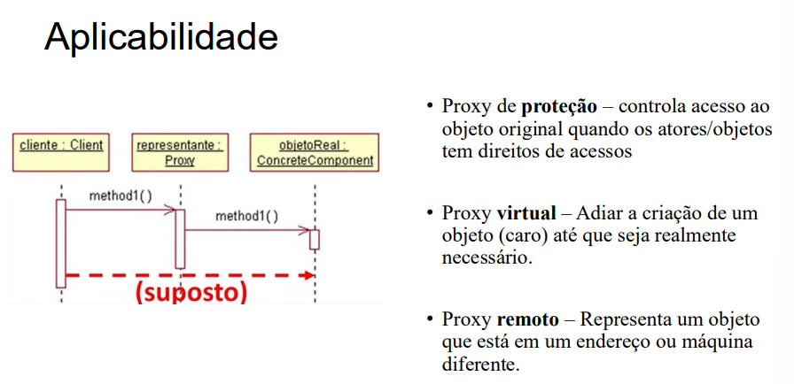
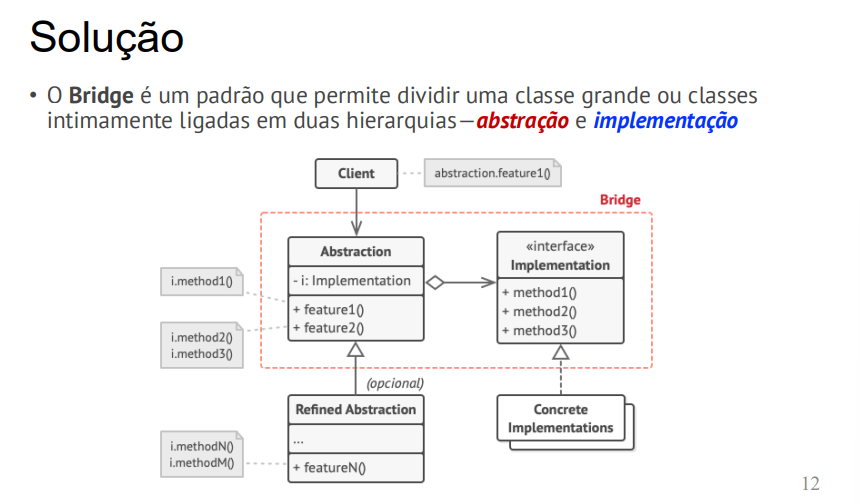
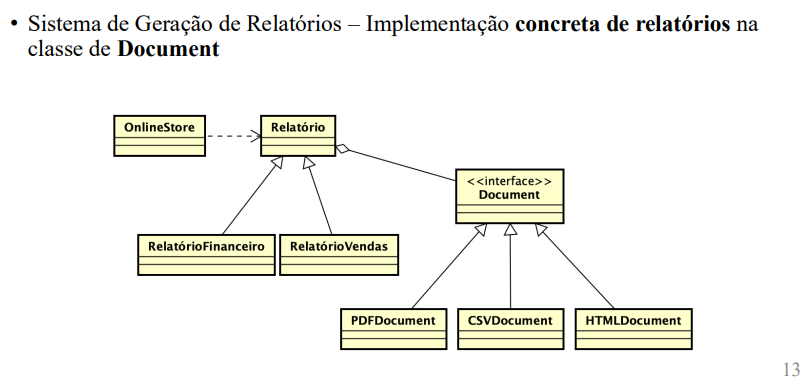

## Padrões de Projeto Estruturais
- Explicam como montar objetos e classes em estruturas maiores mas ainda mantendo essas estruturas flexíveis e eficientes.

### 1. Decorator
- O padrão Decorator permite adicionar funcionalidades a um objeto dinamicamente, sem alterar sua estrutura original. Ele envolve o objeto original com uma nova classe que adiciona o comportamento desejado.

- É um padrão que permite que você acople novos comportamentos para objetos ao colocá-los dentro de invólucros de objetos que contém os comportamentos.

--- 

---

### 2. Facade
Facade é um padrão que disponibiliza uma interface simplificada para uma das funcionalidades de uma API, por exemplo. Um façade pode ser usada para: 

> tornar uma biblioteca de software mais fácil de entender e usar; 

> tornar o código que utiliza esta biblioteca mais fácil de entender; 

> reduzir as dependências em relação às características internas de uma biblioteca, trazendo flexibilidade no desenvolvimento do sistema; 

> envolver uma interface mal desenhada, com uma interface melhor definida.

- Resumindo:  Uma **classe fachada** fornece uma interface simplificada para um conjunto complexo de classes, bibliotecas ou frameworks. **Nela o usuário interage com a fachada ao invés de interagir diretamente com o sistema complexo.**

---

---

### 3. Composite
- Intenção : Compõe objetos em estrutras em árvore para representar hierarquias todo-parte. Composite permite que os clientes tratem objetos individuasi e composições de objetos de maneira uniforme

---

### 5. Proxy
- O Proxy é um padrão de projeto estrutural que fornece um substituto ou representante de outro objeto para controlar o acesso a ele.

---

---

### 6. Bridge
- O Bridge é um padrão de projeto estrutural que separa a abstração de sua implementação

---

---